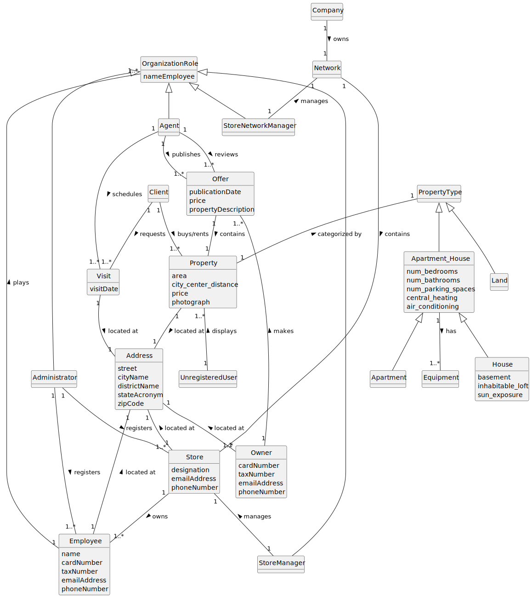

# Analysis

The construction process of the domain model is based on the client specifications, especially the nouns (for _concepts_) and verbs (for _relations_) used. 

## Rationale to identify domain conceptual classes ##
To identify domain conceptual classes, start by making a list of candidate conceptual classes inspired by the list of categories suggested in the book "Applying UML and Patterns: An Introduction to Object-Oriented Analysis and Design and Iterative Development". 

### _Conceptual Class Category List_ ###

**Business Transactions**

*

---

**Transaction Line Items**

* Property
* Apartment
* House
* Land

---

**Product/Service related to a Transaction or Transaction Line Item**

*  Offer
*  Visit

---

**Transaction Records**

*  

---  

**Roles of People or Organizations**

* Administrator
* Agent
* Employee
* Client
* Owner
* Store Manager
* Store Network Manager
* Unregistered User

---

**Places**

* Property
* Apartment
* House
* Land
* Store

---

**Noteworthy Events**

* Visit

---

**Physical Objects**

* Equipment

---

**Descriptions of Things**

* Address

---

**Catalogs**

*  

---

**Containers**

* Property
* PropertyType
* OrganizationRole

---

**Elements of Containers**

* Land
* Apartment_House
* House
* Apartment
* Administrator
* Agent
* Store Manager
* Store Network Manager

---

**Organizations**

* Company
* Store

---

**Other External/Collaborating Systems**

*  

---

**Records of finance, work, contracts, legal matters**

* 

---

**Financial Instruments**

* 

---

**Documents mentioned/used to perform some work/**

* 
---

###**Rationale to identify associations between conceptual classes**###

An association is a relationship between instances of objects that indicates a relevant connection and that is worth of remembering, or it is derivable from the List of Common Associations: 

+ **_A_** is physically or logically part of **_B_**
+ **_A_** is physically or logically contained in/on **_B_**
+ **_A_** is a description for **_B_**
+ **_A_** known/logged/recorded/reported/captured in **_B_**
+ **_A_** uses or manages or owns **_B_**
+ **_A_** is related with a transaction (item) of **_B_**
+ etc.

| Concept (A) 		       |  Association   	|       Concept (B) 		|
|--------------------------|:------------------:|--------------------------:|
| Administrator  	       |    is an    	    |          OrganizationRole |
| Administrator  	       |    registers    	|          Employee 		|
| Administrator  	       |    registers    	|          Store 			|
| Agent  	               |    is an    		|          OrganizationRole |
| Agent                    |    publishes       |          Offer 			|
| Agent                    |    reviews         |          Offer 			|
| Agent                    |    schedules       |          Visit    		|
| Apartment  	           |    belongs		 	|          Apartment_House  |
| Apartment_House          |    is contained    | 		   PropertyType   	|
| Apartment_House          |    has             | 		   Equipment   		|
| Client  	               |    buys/rents    	|          Property 		|
| Client                   |    requests        |          Visit 			|
| Company  	               |    owns    		|          Network 			|
| Employee                 |    plays           | 		   OrganizationRole |
| Employee                 |    located at		|		   Address			|
| House  	               |    belongs   		|          Apartment_House  |
| Land  	               |    is a   		 	|          PropertyType 	|
| Network  	               |    contains    	|          Store 		    |
| Offer					   |    contains		|          Property			|
| Owner                    |    makes           |          Offer 			|
| Owner                    |    located at		|		   Address			|
| Property                 |    categorized by  | 		   PropertyType     |
| Property                 |    located at		|		   Address			|
| Store  	               |    owns    		|          Employee         |
| Store                    |    located at		|		   Address			|
| Store Manager  	       |    is an    		|          OrganizationRole |
| Store Network Manager    |    is an    		|          OrganizationRole |
| Store Network Manager    |    manages	 	    |          Network 			|
| Unregistered User        |    displays        |          Property 		|
| Visit                    |    located at		|		   Address			|

## Domain Model

**Do NOT forget to identify concepts atributes too.**

**Insert below the Domain Model Diagram in a SVG format**

