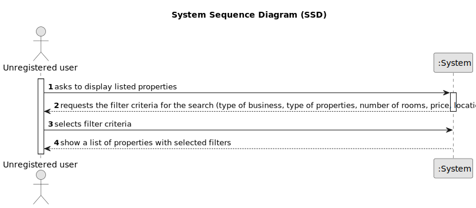

# US 001 - To display listed properties 

## 1. Requirements Engineering

### 1.1. User Story Description

As an unregistered user, I want to display listed properties

### 1.2. Customer Specifications and Clarifications 

**From the specifications document:**

>	The client is, then, responsible for being able to consult the properties by type, number of rooms, and sort by criteria such as price or the parish where the property is located.

**From the client clarifications:**

> **Question:**  When an unregistered user opens the application, are there already properties being listed? If the answer is "YES": then by default, by which criteria are the properties listed? If the answer is "NO": is it mandatory for the user to choose an option (type, number of rooms) or can he/her simply request to view a list of properties that will be automatically ordered, for example, by "most recent"?
>  
> **Answer:** If the system does not contain any properties, the system should show an empty list of properties

> **Question:** An unregistered user can only see sale announcements or he is able to contact the agency agents to make a purchase request ?
>  
> **Answer:** From the project description: "As an unregistered user, I want to display listed properties". For now this is the only functionality of the system that the non-registered user can use.

> **Question:** In the project description it is stated that "the client is, then, responsible for being able to consult the properties by type, number of rooms, and sort by criteria such as price or the parish where the property is located.". Is the client able to sort properties by only these 4 criteria or is he able to sort properties by any of the properties' characteristics?
> 
> **Answer:**  The client should be able to select the type of business (renting or buying), the type of property and the number of rooms. Then, the client should be able to sort properties by price or by parish where the property is located.
If the client does not select the type of business, the type of property and the number of rooms, the application should allow the client to sort all properties that are on sale or on renting.

> **Question:** The properties can be in sale and lease at the same time?
> 
> **Answer:** No.

### 1.3. Acceptance Criteria

* **AC1:** There must be search filters for the property, and they must be filled in.
* **AC2:** The unregistered user must set a min price of 0.
* **AC3:** For the type of business the user must select renting or sale.
* **AC4:** For the type of property there are apartments, lands, houses.
* **AC5:** The property must have a location.

### 1.4. Found out Dependencies

* There is a dependency to "US004 - To submit a request for listing a property" because there must be at least one property available to search and have a list.

### 1.5 Input and Output Data

**Input Data:**

* Typed data:
  * The price
	
* Selected data:
    * Type of business
	* Parish where the property is located
	* Types of properties
	* Number of rooms

**Output Data:**
* List of available properties

### 1.6. System Sequence Diagram (SSD)

### 1.7 Other Relevant Remarks

n/a