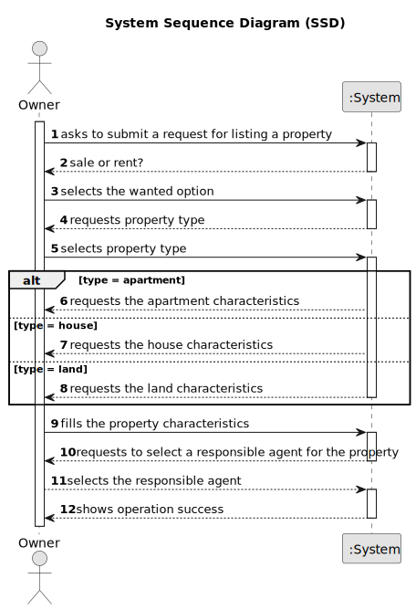

# US 004 - To submit a request to sale or rent a Property

## 1. Requirements Engineering

### 1.1. User Story Description

As an owner, I intend to submit a request for listing a property sale or rent,
choosing the responsible agent.

### 1.2. Customer Specifications and Clarifications 

**From the specifications document:**

>  Each request is characterized by having the property type,
the area, the location, the distance from the city centre, the requested price and one or more
photographs. 

>  If the property is an apartment or a house, the owner also provides: the number of
bedrooms, the number of bathrooms, the number of parking spaces and the available equipment,
such as central heating and/or air conditioning. 

>  In case the property is a house, the existence of a
basement, an inhabitable loft, and sun exposure must be registered as well.

**From the client clarifications:**

> **Question:** What are the different properties types?
>
> **Answer:** Apartment, house or land.

> **Question:** Which is the unit of measurement used to the area of a property?
>  
> **Answer:** The unit of measurement is m2.

### 1.3. Acceptance Criteria

* **AC1:** All required fields must be filled in, except the number of bathrooms, the available equipment and the sun exposure. For the photograph, at least one is required.
* **AC2:** The responsible agent must be selected.
* **AC3:** The sun exposure need to have one of the following values: North, South, East, or West.
* **AC4:** The minimum price is 0.

### 1.4. Found out Dependencies

* There is a dependency to "US003 To register a Employee" since the manager needs to exist so the owner can select him.

### 1.5 Input and Output Data

**Input Data:**

* Typed data:
	* the area
	* the location
	* the distance from the city center
	* a price
	* the number of bedrooms
    * the number of bathrooms
    * the number of parking spaces
    * the available equipment
    * an inhabitable loft
    * the sun exposure
	
* Selected data:
	* the property type
    * the existence of a basement
    * the responsible agent

**Output Data:**

* (In)Success of the operation

### 1.6. System Sequence Diagram (SSD)

### 1.7 Other Relevant Remarks

n/a