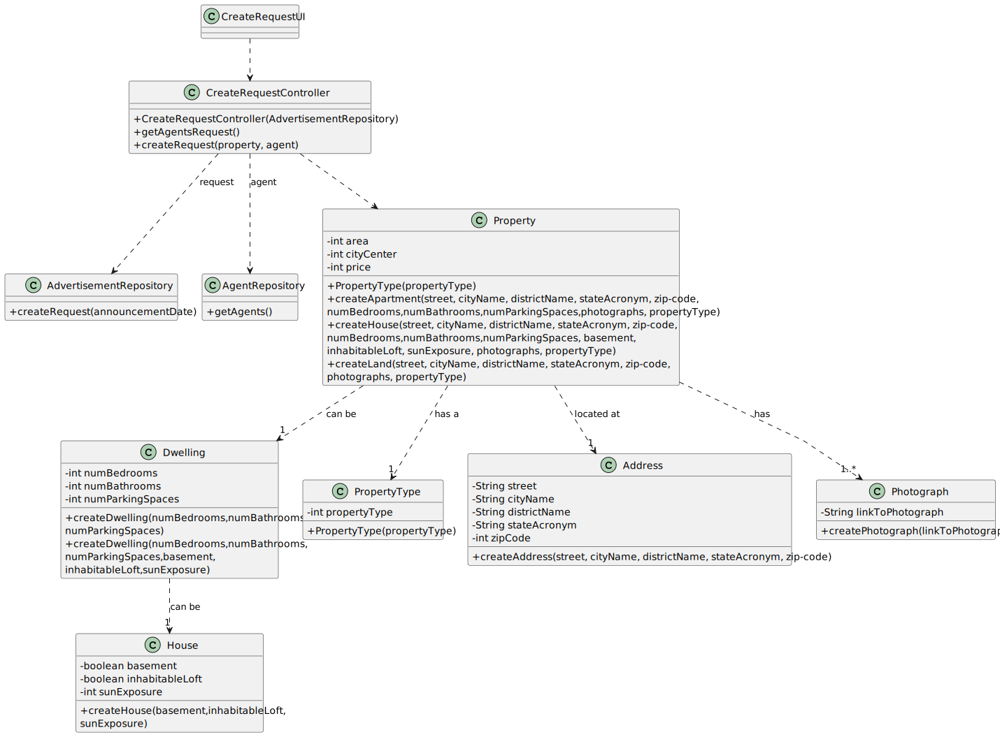

# US 004 - To submit a request to sale or rent a Property

## 3. Design - User Story Realization 

### 3.1. Rationale

**SSD - Alternative 1 is adopted.**

| Interaction ID                                                  | Question: Which class is responsible for...          | Answer                  | Justification (with patterns)                                                                                     |
|:----------------------------------------------------------------|:-----------------------------------------------------|:------------------------|:------------------------------------------------------------------------------------------------------------------|
| Step 1: Asks to register a new property                         | ... interacting with the actor?                      | CreateRequestUI         | Pure Fabrication: there is no reason to assign this responsibility to any existing class in the Domain Model.     |
| 		                                                              | ... coordinating the US?                             | CreateRequestController | Controller                                                                                                        |
| 		                                                              | ... instantiating a new Request?                     | Owner                   | Creator (Rule 1): in the DM Organization has a Task.                                                              |
| 			  		                                                         | ... knowing the user using the system?               | UserSession             | IE: cf. A&A component documentation.                                                                              |
| Step 2: Asks if wants to request a sale or rent	                | ...displaying the UI for the owner to input data?    | CreateRequestUI         | Pure Fabrication: there is no reason to assign this responsibility to any existing class in the Domain Model.     |
| Step 3: Selects wanted option	                                  | ...validating the inputted data?                     | CreateRequestController | Controller                                                                                                        |
| Step 4: Asks the property type	                                 | ...displaying the UI for the owner to input data?    | CreateRequestUI         | Pure Fabrication: there is no reason to assign this responsibility to any existing class in the Domain Model.     |
| Step 5: Selects the property type	                              | ...validating the inputted data?                     | CreateRequestController | Controller                                                                                                        |
| Step 6: Requests the property characteristics	                  | ...displaying the UI for the owner to fill the form? | CreateRequestUI         | Pure Fabrication: there is no reason to assign this responsibility to any existing class in the Domain Model.     | 
| Step 7: Fills the property characteristics                      | ...validating the inputed data?                      | CreateRequestController | IE: owns its data.                                                                                                |
| Step 8: Asks to insert photos	                                  | ...displaying the UI for the owner to fill the form? | CreateRequestUI         | Pure Fabrication: there is no reason to assign this responsibility to any existing class in the Domain Model.     | 
| Step 9: Inserts photos                                          | ...validating the inputed data?                      | CreateRequestController | IE: owns its data.                                                                                                |
| Step 8: Requests to select a responsible agent for the property | ...get list of agents?                               | AgentRepository         | Pure Fabrication: there is no reason to assign this responsibility to any existing class in the Domain Model.     |
| Step 9: Selects the responsible agent                           | ...validating the inputted data?                     | CreateRequestController | Controller                                                                                                        |
| 			  		                                                         | ... validating all data (global validation)?         | RequestRepository       | IE: knows all its tasks.                                                                                          | 
| 			  		                                                         | ... validating all data (global validation)?         | Property                | IE: knows all its tasks.                                                                                          | 
| 			  		                                                         | ... validating all data (global validation)?         | Dwelling                | IE: knows all its tasks.                                                                                          | 
| 			  		                                                         | ... saving the created request?                      | Owner                   | IE: owns all its tasks.                                                                                           | 
| Step 10: Shows operation success 		                             | ... informing operation success?                     | CreateRequestUI         | IE: is responsible for user interactions.                                                                         | 

### Systematization ##

According to the taken rationale, the conceptual classes promoted to software classes are: 

 * Owner
 * Property
 * PropertyType
 * Dwelling
 * House
 * Address
 * Photograph

Other software classes (i.e. Pure Fabrication) identified: 

 * CreateRequestUI  
 * CreateRequestController
 * AgentRepository
 * RequestRepository

## 3.2. Sequence Diagram (SD)

### Alternative 1 - Full Diagram

This diagram shows the full sequence of interactions between the classes involved in the realization of this user story.

### Alternative 2 - Split Diagram

This diagram shows the same sequence of interactions between the classes involved in the realization of this user story, but it is split in partial diagrams to better illustrate the interactions between the classes.

It uses interaction ocurrence.

**Create Property Partial SD**

## 3.3. Class Diagram (CD)

