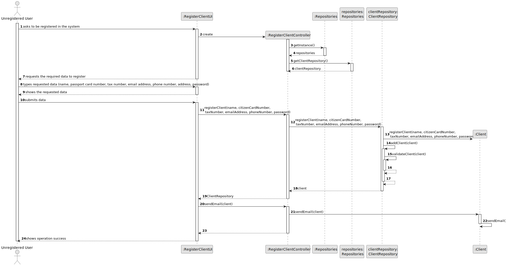
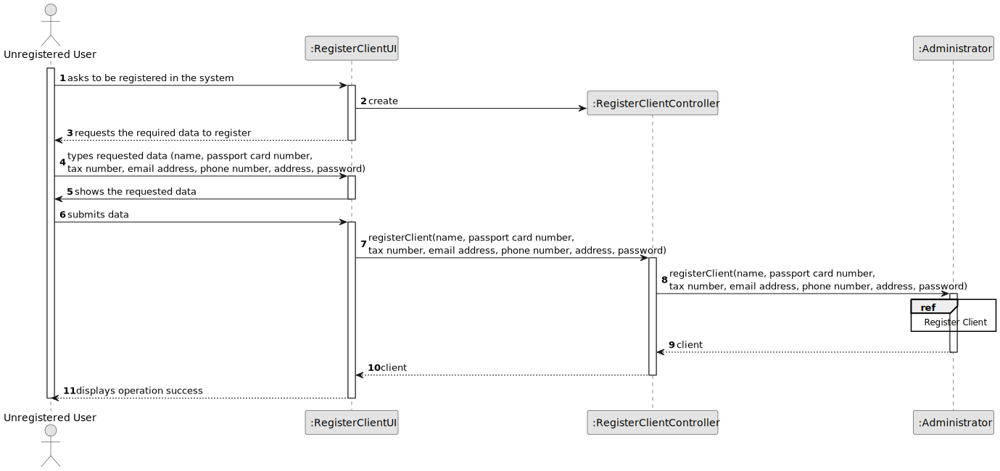
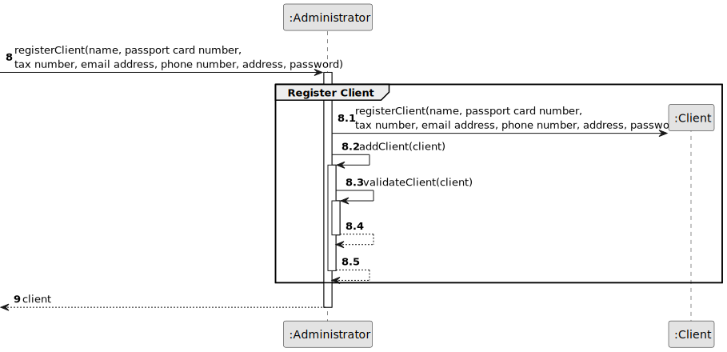
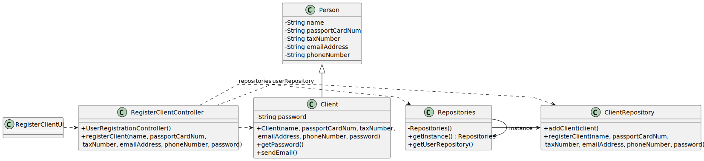

# US 007 - To register an unregistered user 

## 3. Design - User Story Realization 

### 3.1. Rationale

| Interaction ID                                  | Question: Which class is responsible for...        | Answer                   | Justification (with patterns)                                  |
|:------------------------------------------------|:---------------------------------------------------|:-------------------------|:---------------------------------------------------------------|
| Step 1: asks to be registered in the system  		 | 	... interacting with the actor?                   | RegisterClientUI         | Pure Fabrication.                                              |
| 			  		                                         | 	... coordinating the US?                          | RegisterClientController | Controller.                                                    |
| 			  		                                         | 	... instantiating all the repositories            | Repositories             | IE: knows all the repositories.                                |
| Step 2: requests the required data to register  |                                                    |                          |                                                                |
| Step 3: types requested data  		                | 							                                            |                          |                                                                |
| Step 6: shows the requested data                | 	... showing the information and asking to confirm | RegisterClientUI         | Pure Fabrication                                               |
| Step 7: submits data   		                       | 	...creating a new client?                         | ClientRepository         | Creator (Rule 2) : contains User and stores instances of User. |
| 		                                              | 	...validating all data (local validation)?        | Client                   | Information Expert: knows its own data.                        |
|                                                 | ...validating all data (global validation)?        | ClientRepository         | IE: knows and stores all the users/Pure Fabrication.           |
| 	 	                                             | 	...saving the created client?                     | ClientRepository         | IE: knows and stores all the users/Pure Fabrication.           |              
| 		                                              | 	... sending email with client password            | Client                   | IE: knows its own information.                                 | 
| Step 8: shows operation success  		             | 	... informing operation success?                  | RegisterClientUI         | Pure Fabrication.                                              | 

### Systematization ##

According to the taken rationale, the conceptual classes promoted to software classes are: 

 * Client

Other software classes (i.e. Pure Fabrication) identified: 

 * RegisterClientUI  
 * RegisterClientController
 * Repositories
 * ClientRepository

## 3.2. Sequence Diagram (SD)

### Alternative 1 - Full Diagram

This diagram shows the full sequence of interactions between the classes involved in the realization of this user story.

### Alternative 2 - Split Diagram

This diagram shows the same sequence of interactions between the classes involved in the realization of this user story, but it is split in partial diagrams to better illustrate the interactions between the classes.

It uses interaction occurrence.

**Register Client**

## 3.3. Class Diagram (CD)

