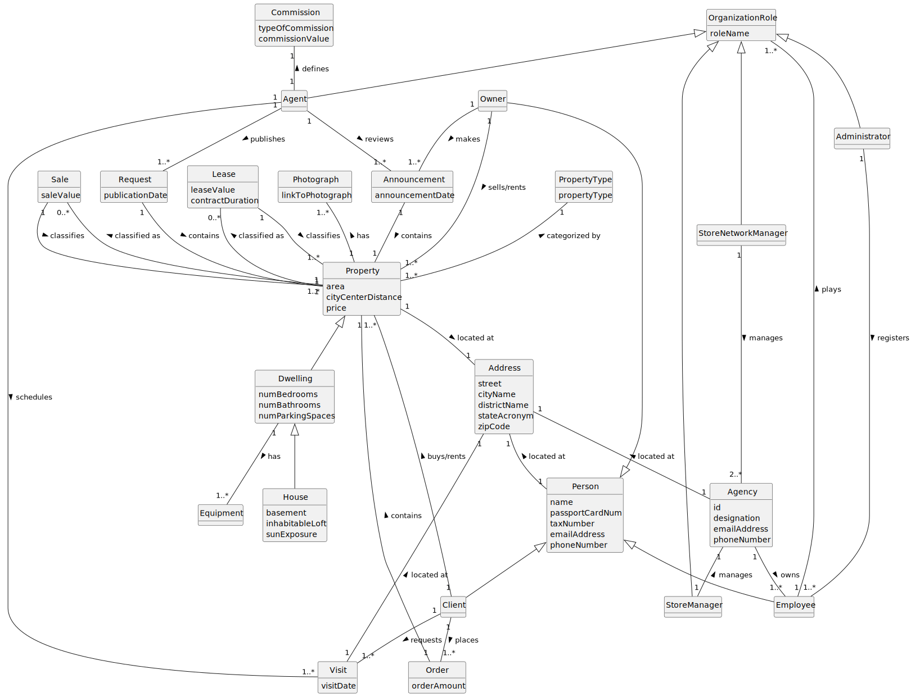

# Analysis

The construction process of the domain model is based on the client specifications, especially the nouns (for _concepts_) and verbs (for _relations_) used. 

## Rationale to identify domain conceptual classes ##
To identify domain conceptual classes, start by making a list of candidate conceptual classes inspired by the list of categories suggested in the book "Applying UML and Patterns: An Introduction to Object-Oriented Analysis and Design and Iterative Development". 

### _Conceptual Class Category List_ ###

**Business Transactions**

* Commission
* Order

---

**Transaction Line Items**

* Property
* Apartment
* House
* Land

---

**Product/Service related to a Transaction or Transaction Line Item**

*  Request
*  Visit

---

**Transaction Records**

*  

---  

**Roles of People or Organizations**

* Administrator
* Agent
* Employee
* Client
* Owner
* Store Manager
* Store Network Manager

---

**Places**

* Property
* Apartment
* House
* Land
* Store

---

**Noteworthy Events**

* Visit

---

**Physical Objects**

* Equipment

---

**Descriptions of Things**

* Address
* Photograph
* Advertisement
* PropertyType

---

**Catalogs**

*  

---

**Containers**

* Property
* OrganizationRole
* Person

---

**Elements of Containers**

* Land
* Dwelling
* House
* Apartment
* Administrator
* Agent
* Store Manager
* Store Network Manager
* Owner
* Client
* Employee

---

**Organizations**

* Store

---

**Other External/Collaborating Systems**

* LegacySystem 

---

**Records of finance, work, contracts, legal matters**

* 

---

**Financial Instruments**

* Commission
* Order

---

**Documents mentioned/used to perform some work**

* 
---

###**Rationale to identify associations between conceptual classes**###

An association is a relationship between instances of objects that indicates a relevant connection and that is worth of remembering, or it is derivable from the List of Common Associations: 

+ **_A_** is physically or logically part of **_B_**
+ **_A_** is physically or logically contained in/on **_B_**
+ **_A_** is a description for **_B_**
+ **_A_** known/logged/recorded/reported/captured in **_B_**
+ **_A_** uses or manages or owns **_B_**
+ **_A_** is related with a transaction (item) of **_B_**
+ etc.

| Concept (A) 		      |   Association   	 |   Concept (B) 		 |
|------------------------|:--------------------:|-----------------:|
| Administrator  	      |      is an    	    | OrganizationRole |
| Administrator  	      |    registers        |       Employee 	 |
| Administrator          |    imports           |     LegacySystem |
| Agent                  |       defines        |       Commission |
| Agent  	              |     is an    		| OrganizationRole |
| Agent                  |      publishes       |        Request 	 |
| Agent                  |       reviews        |  Advertisement 	 |
| Agent                  |      schedules       |       Visit    	 |
| Apartment  	          |     belongs		 	|         Dwelling |
| Dwelling               |     is contained     |     	   Property |
| Dwelling               |         has          |    	   Equipment |
| Client                 |    is a              |           Person |
| Client                 | places               |            Order |
| Client  	              |   buys/rents    	    |       Property 	 |
| Client                 |       requests       |          Visit 	 |
| Employee               |       is a           |           Person |
| Employee               |        plays         | OrganizationRole |
| Employee               |     located at		|         Address	 |
| House  	              |     belongs   		|         Dwelling |
| Land  	              |     is a   		 	|       Property 	 |
| LegacySystem           |    contains         |         Property |
| LegacySystem           |    contains         |            Owner |
| LegacySystem           |    contains         |           Agency |
| LegacySystem           |    contains         |       Commission |
| Request				  |      contains		|        Property	 |
| Order                  |   contains           |         Property |
| Owner                  |        makes         |        Request 	 |
| Owner                  |     located at		|      	   Address |
| Owner                  |     is a             |           Person |
| Property               |         has          |       Photograph |
| Property               |    categorized by    | 	   PropertyType |
| Property               |     located at		|     	   Address	 |
| Store  	              |      owns    		|         Employee |
| Store                  |     located at		|     	   Address	 |
| Store Manager  	      |     is an    		| OrganizationRole |
| Store Network Manager  |     is an    		| OrganizationRole |
| Store Network Manager  |      manages	 	    |          Store 	 |
| Visit                  |     located at		|     	   Address	 |

## Domain Model

**Do NOT forget to identify concepts attributes too.**

**Insert below the Domain Model Diagram in a SVG format**

