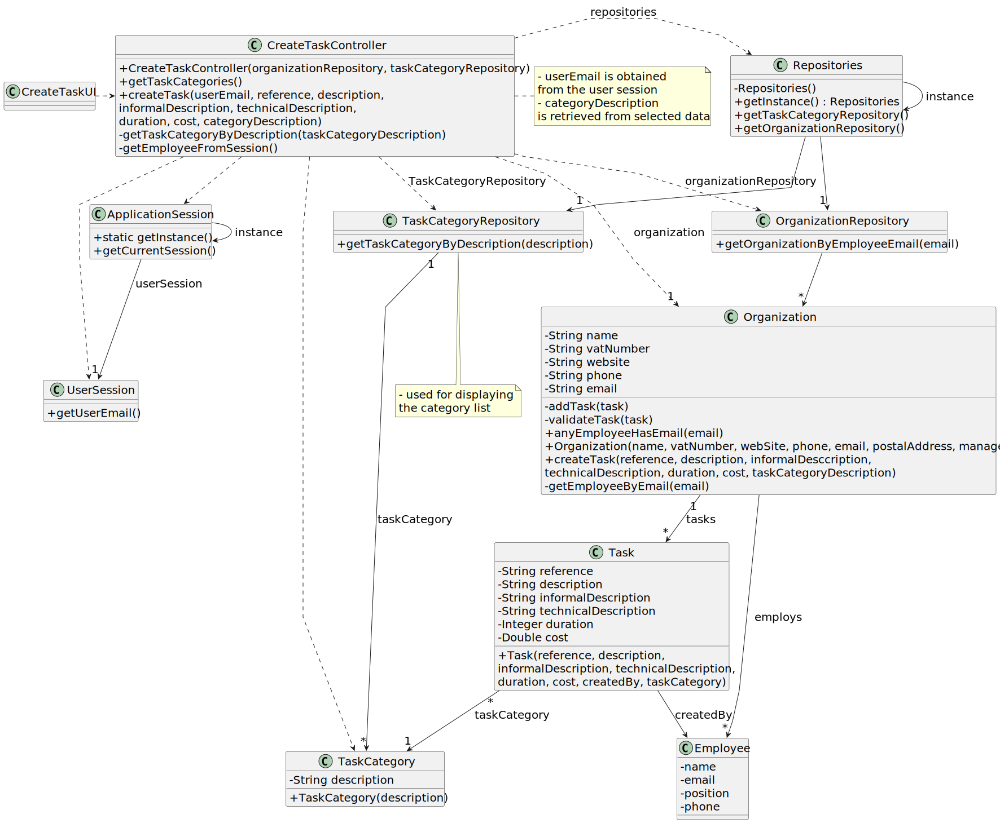

# US 001 - To display listed properties 

## 3. Design - User Story Realization 

### 3.1. Rationale

**SSD - Alternative 1 is adopted.**

| Interaction ID                                             | Question: Which class is responsible for...  | Answer                   | Justification (with patterns)                                                                                 |
|:-----------------------------------------------------------|:---------------------------------------------|:-------------------------|:--------------------------------------------------------------------------------------------------------------|
| Step 1 Asks to display listed properties 	                 | 	... interacting with the actor?             | ListPropertiesUI         | Pure Fabrication: there is no reason to assign this responsibility to any existing class in the Domain Model. |
| 			  		                                                    | 	... coordinating the US?                    | ListPropertiesController | Controller                                                                                                    |
| Step 2  Show listed properties and request filter criteria | ... show list of properties for the actor ?	 | PropertiesRepository     | IE: owns its data.                                                                                            |
| Step 3 User want to apply filters	                         | 	...                                         |                          |                                                                                                               |
| Step 4 Select the filter 		                                | 	... Validating inputted data?               | ListPropertiesController | controller                                                                                                    |
| Step 5 Request filter value		                              | 	... Show a list of values?                  | ListPropertiesController | controller                                                                                                    |
| Step 6 Type value		                                        | ...  Validating all data (local validation)? | Property                 | IE: owns its data.                                                                                            | 
|                                                            | ... Validating all data (global validation)? | PropertiesRepository     | IE : owns its data.                                                                                           | 
|                                                            | ... saving the filters?                      | PropertiesRepository     | IE: owns all its tasks.                                                                                       | 
| Step 7 Show Properties with selectd filters 		             | 	...Show the properties?                     | ListPropertiesUI         | IE: is responsible for user interactions.                                                                     | 

### Systematization ##

According to the taken rationale, the conceptual classes promoted to software classes are: 

 * Property
 * Filters

Other software classes (i.e. Pure Fabrication) identified: 

 * ListPropertiesUI 
 * ListPropertiesController

## 3.2. Sequence Diagram (SD)

### Alternative 1 - Full Diagram

This diagram shows the full sequence of interactions between the classes involved in the realization of this user story.

### Alternative 2 - Split Diagram

This diagram shows the same sequence of interactions between the classes involved in the realization of this user story, but it is split in partial diagrams to better illustrate the interactions between the classes.

It uses interaction ocurrence.

**Get Task Category List Partial SD**

**Get Task Category Object**

**Get Employee**

**Create Task**

## 3.3. Class Diagram (CD)

