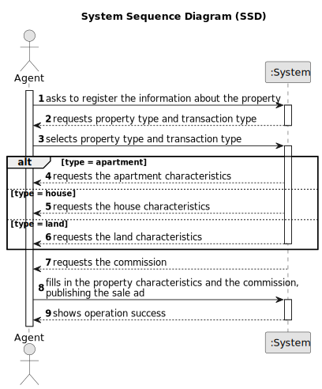

# US 002 - To publish sale announcement 

## 1. Requirements Engineering

### 1.1. User Story Description

As an agent, I can publish any sale announcement on the system, for
example received through a phone call.

### 1.2. Customer Specifications and Clarifications 

**From the specifications document:**

>	"The owner provides property characteristics and the requested price and sends the request to an agent."

>	"The real estate agent reviews advertisement requests, registers the information in the system and
publishes the offer so that it is visible to all clients who visit the agency and use the application"

**From the client clarifications:**

> **Question:** Can an Agent work in more than 1 store (Multiple stores)?
>  
> **Answer:** No.

> **Question:** After the Agent confirms the offer can it be canceled in the application ?
>
> **Answer:** No.
 

> **Question:** How does the agent determine whether it is a fixed commission or a percentage commission?
>
> **Answer:** The agent should choose the type of commission and enter the value.
 

> **Question:** Is the phone call the only way the agent can receive the sale announcement? Or he can receive them via e-mail/letter/etc
>
> **Answer:** For now this is the only way.
 

> **Question:** Also, must the agent who reviews and publishes an advertisement request be the same agent who accepts or rejects the purchase/lease request for that listing?
>
> **Answer:** The agent that receives the request is the one that posts the announcement.

> **Question:** Should we consider that, until the request is reviewed and posted, the request stays in a "not published" state?
>
> **Answer:** This is an implementation detail. For me, as a client, I want the feature implemented as I already described in the project description.

> **Question:** When the request arrives at the agent, are all the essential characteristics of the property in question already present?
>
> **Answer:** Yes.

> **Question:** Is it necessary to publish the owner attributes on the sale announcement?
>
> **Answer:** No.

> **Question:** Are there any acceptance criteria for the agent to accept/reject an order for sale? When the agent asks to open a list of orders for sale (in the system) are these separated by some criteria, for example, the type of property, or all orders are together?
>
> **Answer:** In the beginning of Sprint C we will introduce new requirements that will clarify your questions.

> **Question:** Is it mandatory for the agent to input the commission value before publishing an announcement?
>
> **Answer:** Yes.

> **Question:**  Do requests have any reference/code identifying them with any specific format? What about descriptions (any restrictions, like character limit)? Does that reference carry out with the advertisement?
>
> **Answer:** Please choose appropriate data formats for the request. You are a team of experts and you should choose appropriate formats. In the next sprints I will specify some data formats.
 
 
> **Question:** When the agent receives the phone call (as mentioned in US002) is it the agent who registers the order in the system or has the order already been entered into the system by the owner? Or is the phone call just for the owner to tell the agent that he registered a request in the system?
>
> **Answer:** The agent registers the order in the system.
 
 
> **Question:** What are the attributes of an announcement? Should the announcement have a publication date, and a defined type of announcement embeded (sale or rent)?
>
> **Answer:** Please check the project description available in moodle. Please show the publication date.
 
 
> **Question:** In USS02 are all the criteria for publishing the sale of a property in the system mandatory, or is there any data that the owner can choose not to give? such as not saying the direction of sun exposure in the case of a house.
>
> **Answer:**  The number of bathrooms, the available equipment and the sun exposure are not mandatory. At least one photograph is required.
  
 
> **Question:** Also, since the only way that an agent can receive sale announcement request is through a phone call, wouldn't that contradict what was stated in the project description: "Owners go to one of the company's branches and meet with a real estate agent to sell or rent one or more properties, or they can use the company's application for the same purposes."?
>
> **Answer:** US2: As an agent, I can publish any sale announcement on the system, for example received through a phone call. For example...

 
> **Question:** What would be the attributes of the Owner and Agent?
>
> **Answer:** The Owner attributes are: the name, the citizen's card number, the tax number, the address, the email address and the contact
telephone number. The Agent is an employee of the company.

> **Question** No question
>
> **Answer:** In US2 the agent should identify, in the system, the owner that wants to sell a property. The agent should use the owner e-mail address to identify the owner. The owner who is contacting the agent (for example, through a phone call) must be registered in the system. The agent that receives the phone call is the property responsible agent.

### 1.3. Acceptance Criteria

* **AC1:** All required fields must be filled in.
* **AC2:** The commission value includes the agent and the company commission.
* **AC3:** There's only two types of commission: fixed and percentage.
* **AC4:** The type of transaction (sale/lease) must be selected.

### 1.4. Found out Dependencies

* There is a dependency to "US003 As a system administrator, I want to register a new employee." since an agent is an employee which is registered by a system administrator.
* There is a dependency to "US004 As an owner, I intend to submit a request for listing a property sale or rent,
  choosing the responsible agent." since the agent is chosen as the responsible for a certain sale or rent.

### 1.5 Input and Output Data

**Input Data:**

* Typed data:
	* the commission value
	* the property information
  
	
* Selected data:
  * the property type
  * commission category
  * the transaction type (sale/lease)

**Output Data:**

* (In)Success of the operation

### 1.6. System Sequence Diagram (SSD)

### 1.7 Other Relevant Remarks

* The phone call is the only way the agent can receive the sale announcement.