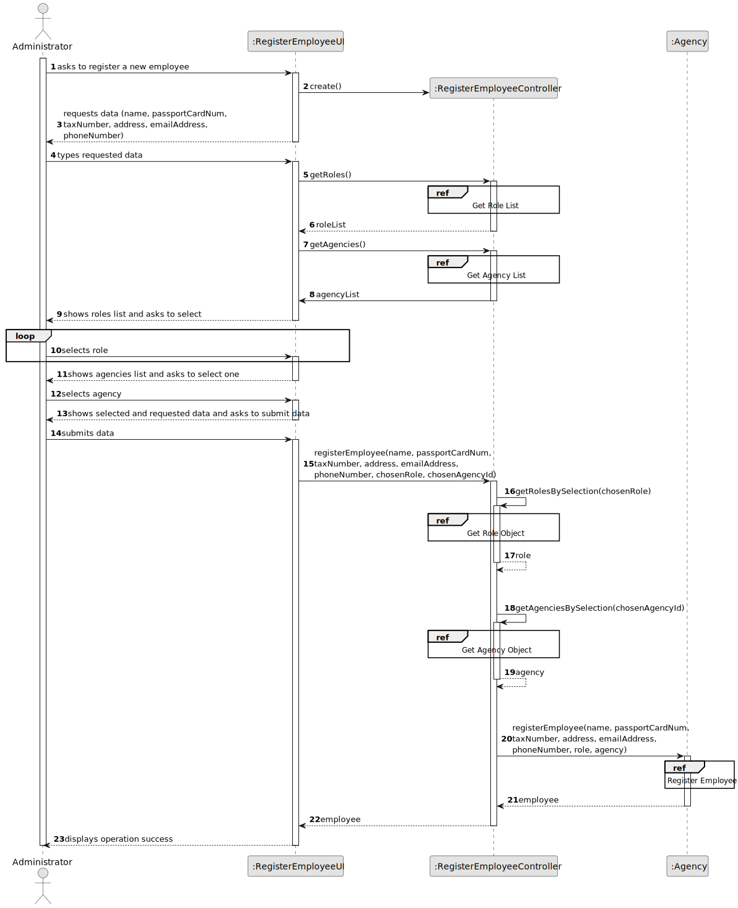
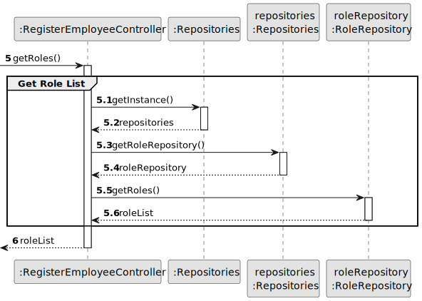
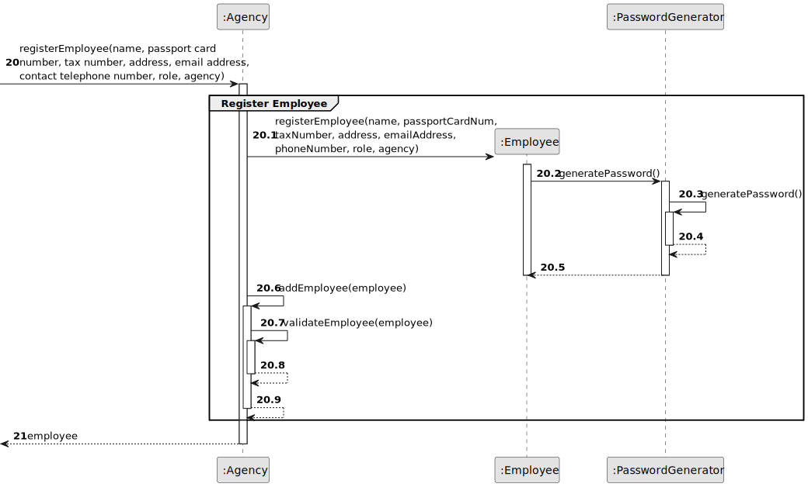
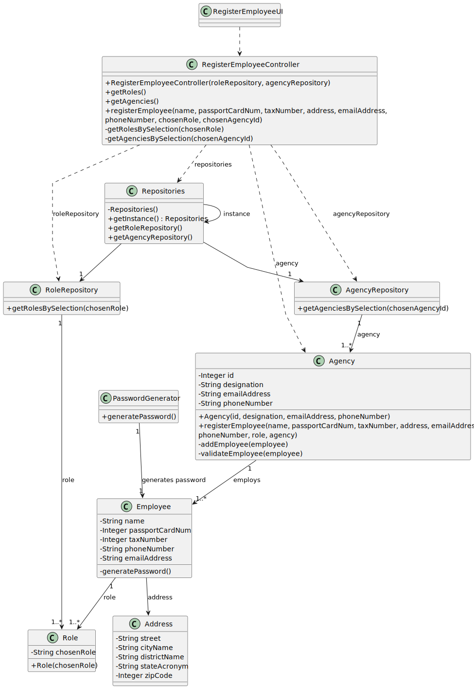

# US 003 - To register an employee 

## 3. Design - User Story Realization 

### 3.1. Rationale

| Interaction ID                                                        | Question: Which class is responsible for...         | Answer                     | Justification (with patterns)                                                                                 |
|:----------------------------------------------------------------------|:----------------------------------------------------|:---------------------------|:--------------------------------------------------------------------------------------------------------------|
| Step 1: asks to register a new employee  		                     | ... interacting with the actor?                     | RegisterEmployeeUI         | Pure Fabrication: there is no reason to assign this responsibility to any existing class in the Domain Model. |
| 			  		                                                     | ... coordinating the US?                            | RegisterEmployeeController | Controller                                                                                                    |
| 			  		                                                     | ... instantiating a new Employee?                   | Agency                     | Creator (Rule 1): in the DM Agency owns Employee.                                                             |
| Step 2: requests data  		                                         | ... displaying the UI for the actor to input data?  | RegisterEmployeeUI         | Pure Fabrication: there is no reason to assign this responsibility to any existing class in the Domain Model. |
| Step 3: types requested data  		                                 | ... validating input data? 	                        | RegisterEmployeeUI         | Pure Fabrication: there is no reason to assign this responsibility to any existing class in the Domain Model. |
|                                                                       | ... saving the inputed data?                        | Employee                   | IE: object created in step 1 has its own data.                                                                | 
|                                                                       | ... obtaining the roles list?                       | RoleRepository             | IE and Pure Fabrication                                                                                       |
|                                                                       | ... obtaining the agencies list?                    | AgencyRepository           | IE and Pure Fabrication                                                                                       |
| Step 4: shows roles list and asks to select                           | ... knowing the roles to show?                      | RegisterEmployeeUI         | Pure Fabrication: there is no reason to assign this responsibility to any existing class in the Domain Model. |
| Step 5: selects role 		                                         | ... validating selected data (role)?                | RegisterEmployeeUI         | Pure Fabrication: there is no reason to assign this responsibility to any existing class in the Domain Model. |
|                                                                       | ... temporarily keeping the selected data (role)?   | RegisterEmployeeUI         | Pure Fabrication: there is no reason to assign this responsibility to any existing class in the Domain Model. |
| Step 6: shows agencies list and asks to select one 		             | ... knowing the agencies to show?                   | RegisterEmployeeUI         | Pure Fabrication: there is no reason to assign this responsibility to any existing class in the Domain Model. |              
| Step 7: selects agency 		                                         | ... validating selected data (agency)?              | RegisterEmployeeUI         | Pure Fabrication: there is no reason to assign this responsibility to any existing class in the Domain Model. | 
| 			  		                                                     | ... temporarily keeping the selected data (agency)? | RegisterEmployeeUI         | Pure Fabrication: there is no reason to assign this responsibility to any existing class in the Domain Model. |
| Step 8: shows selected and requested data and asks to submit data  	 | ... display all the information before submiting?   | RegisterEmployeeUI         | Pure Fabrication: there is no reason to assign this responsibility to any existing class in the Domain Model. |
| Step 9: submits data                                                  | ... validating all data (local validation)?         | Employee                   | IE: owns its data.                                                                                            | 
| 			  		                                                     | ... validating all data (global validation)?        | Agency                     | IE: knows all its employees.                                                                                  | 
|                                                                       | ... generating and saving the password and id?      | Employee                   | IE: knows its "password" and "id"                                                                             |
| 			  		                                                     | ... saving the registered employee?                 | Agency                     | IE: owns all its employees.                                                                                   |            
| Step 10: shows operation success                                      | ... informing operation success?                    | RegisterEmployeeUI         | IE: is responsible for user interactions.                                                                     | 
|                                                                       | ... generating the password for the employee?       | PasswordGenerator          | Pure Fabrication: there is no reason to assign this responsibility to any existing class in the Domain Model. |

### Systematization ##

According to the taken rationale, the conceptual classes promoted to software classes are: 

 * Employee
 * Agency

Other software classes (i.e. Pure Fabrication) identified: 

 * RegisterEmployeeUI  
 * RegisterEmployeeController
 * RoleRepository
 * AgencyRepository
 * PasswordGenerator

## 3.2. Sequence Diagram (SD)

### Alternative 1 - Full Diagram

This diagram shows the full sequence of interactions between the classes involved in the realization of this user story.

### Alternative 2 - Split Diagram

This diagram shows the same sequence of interactions between the classes involved in the realization of this user story, but it is split in partial diagrams to better illustrate the interactions between the classes.

It uses interaction occurrence.

**Get Role List Partial SD**

**Get Agency List Partial SD**

**Get Role Object**

**Get Agency Object**

**Register Employee**

## 3.3. Class Diagram (CD)

