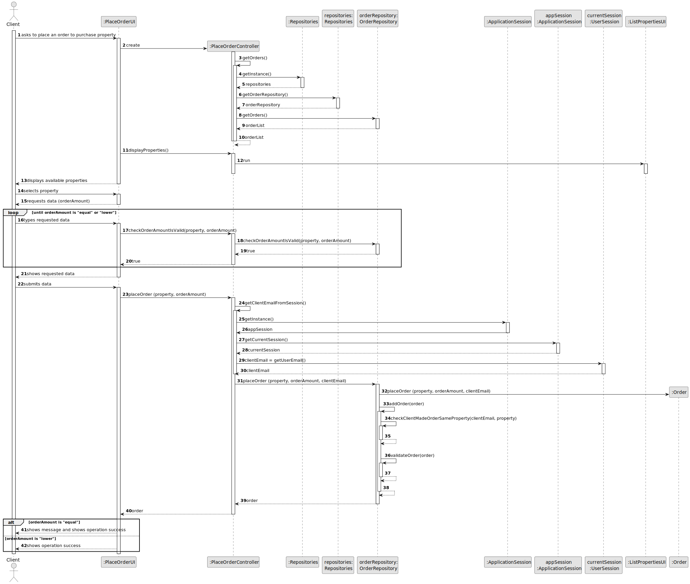
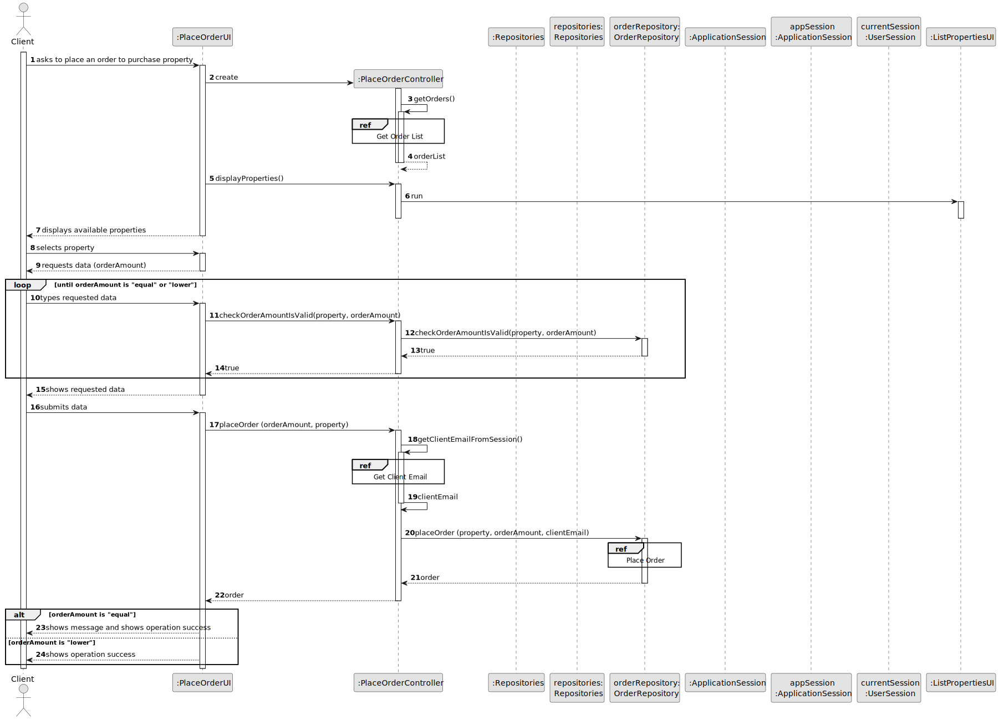
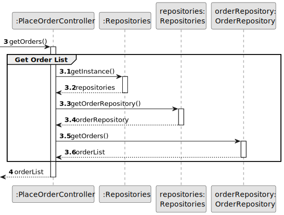
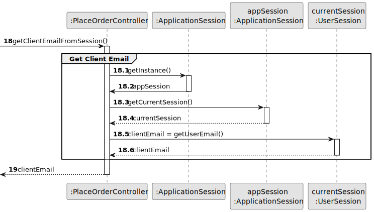
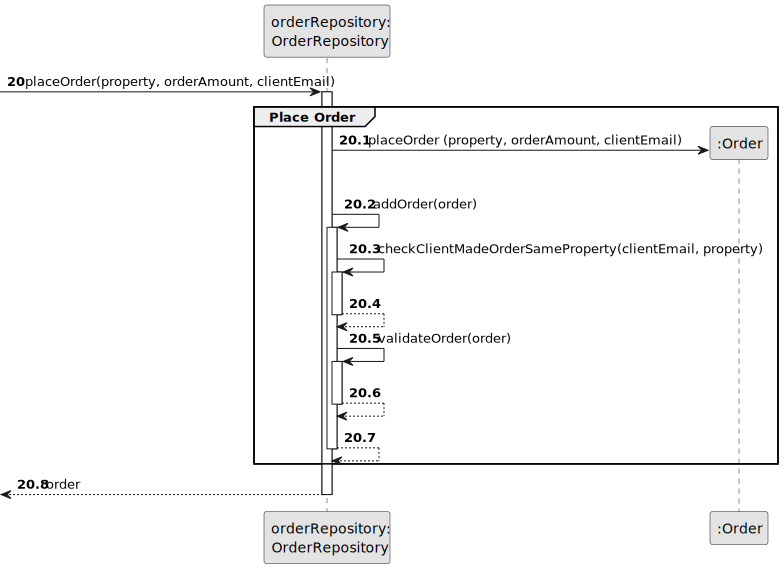
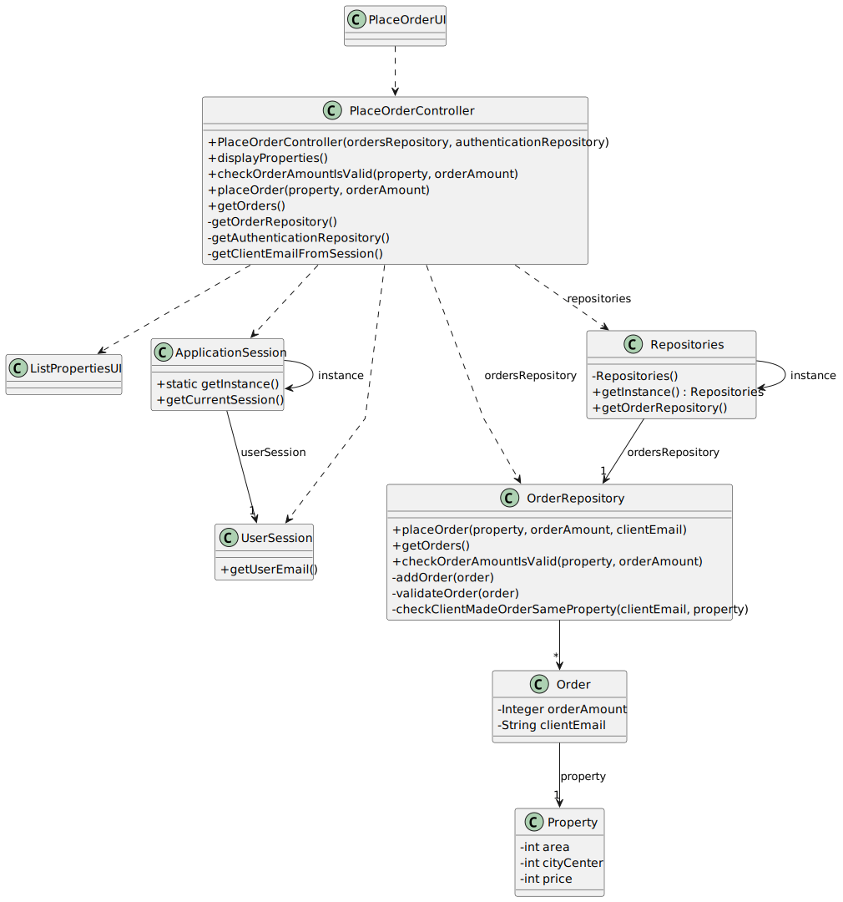

# US 010 - To place order to purchase property 

## 3. Design - User Story Realization 

### 3.1. Rationale

**SSD - Alternative 1 is adopted.**

| Interaction ID                                      | Question: Which class is responsible for...        | Answer                | Justification (with patterns)                                                                                 |
|:----------------------------------------------------|:---------------------------------------------------|:----------------------|:--------------------------------------------------------------------------------------------------------------|
| Step 1: asks to place an order to purchase property | ... interacting with the actor?                    | PlaceOrderUI          | Pure Fabrication: there is no reason to assign this responsibility to any existing class in the Domain Model. |
| 			  		                                   | ... coordinating the US?                           | PlaceOrderController  | Controller                                                                                                    |
|                                                     | ... instantiating a new Order?                     | OrdersRepository      | Creator (Rule 2) : contains Order and stores instances of Order.                                              |
| Step 2: displays available properties               | ... knowing the properties to show?                | ListPropertiesUI      | Pure Fabrication: there is no reason to assign this responsibility to any existing class in the Domain Model. |
| Step 3: selects property                            | ... validating selected data?                      | ListPropertiesUI      | Pure Fabrication: there is no reason to assign this responsibility to any existing class in the Domain Model. |
|                                                     | ... temporarily keeping the selected data?         | ListPropertiesUI      | Pure Fabrication: there is no reason to assign this responsibility to any existing class in the Domain Model. |
| Step 4: requests data                               | ... displaying the UI for the actor to input data? | PlaceOrderUI          | Pure Fabrication: there is no reason to assign this responsibility to any existing class in the Domain Model. |
| Step 5: types requested data                        | ... validating input data?                         | PlaceOrderUI          | Pure Fabrication: there is no reason to assign this responsibility to any existing class in the Domain Model. |
|                                                     | ... checking if the order was already been made?   | OrderRepository       | IE: owns all orders.                                                                                          |
|                                                     | ... saving the inputted data?                      | Order                 | IE: object created in step 1 has its own data.                                                                |
| Step 6: shows requested data                        | ... display all the information before submitting? | PlaceOrderUI          | Pure Fabrication: there is no reason to assign this responsibility to any existing class in the Domain Model. |
| Step 7: submits data                                | ... validating all data (local validation)?        | Order                 | IE: owns its data.                                                                                            |
|                                                     | ... validating all data (global validation)?       | OrdersRepository      | Pure Fabrication: there is no reason to assign this responsibility to any existing class in the Domain Model. |
|                                                     | ... saving the placed order?                       | OrdersRepository      | IE: owns all its orders.                                                                                      |
| Step 8: shows message and shows operation success   | ... showing the message?                           | PlaceOrderUI          | IE: is responsible for user interactions.                                                                     |
| Step 9: shows operation success                     | ... informing operation success?                   | PlaceOrderUI          | IE: is responsible for user interactions.                                                                     |

### Systematization ##

According to the taken rationale, the conceptual classes promoted to software classes are: 

 * Client
 * Order

Other software classes (i.e. Pure Fabrication) identified: 

 * PlaceOrderUI
 * PlaceOrderController
 * OrdersRepository
 * ListPropertiesUI

## 3.2. Sequence Diagram (SD)

### Alternative 1 - Full Diagram

This diagram shows the full sequence of interactions between the classes involved in the realization of this user story.

### Alternative 2 - Split Diagram

This diagram shows the same sequence of interactions between the classes involved in the realization of this user story, but it is split in partial diagrams to better illustrate the interactions between the classes.

It uses interaction occurrence.

**Get Order List**

**Get Client Email**

**Place Order**

## 3.3. Class Diagram (CD)

