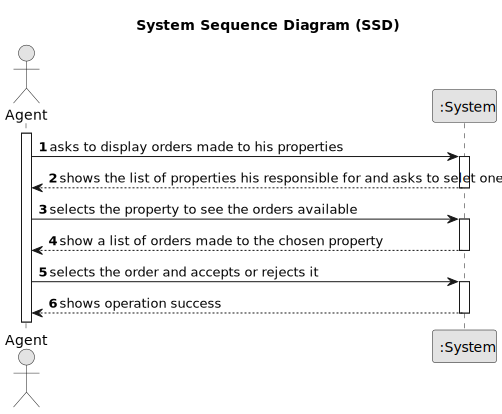

# US 011 - To accept or decline a purchase order for a property and notify the customer by email

## 1. Requirements Engineering

### 1.1. User Story Description

As an agent, I want to list real estate purchase orders to accept or decline a
purchase order for a property. After accepting or declining, an email notification
should be sent to the customer.

### 1.2. Customer Specifications and Clarifications 

**From the specifications document:**

>	The list of purchase orders should be grouped by property. The properties
should be sorted from the oldest to the most recent one. For each property, the
list of purchase orders should be sorted by the amount offered, the highest offer
must appear first.

> For each offer, the agent must be able to accept or decline it. The action of
accepting or declining an offer should trigger an email notification to the client.

>  When a purchase order is accepted, all the other orders should be declined,
and a message sent to the client.

>  If a property does not contain any offers, the system should show an empty
list of offers.

**From the client clarifications:**

> **Question:**  What happens to the announcement of the property after the order as been accepted?
>  
> **Answer:** If the request is accepted, the offer will not be shown again to clients using the application.

### 1.3. Acceptance Criteria

* **AC1:** There must be search filters for the offer, and they must be filled in.
* **AC2:** The offer must have a minimal price to be accepted.

### 1.4. Found out Dependencies

* There is a dependency to "US010 - To place an order to purchase the property, submitting the order amount" because there must be made at least one order for the property to list.

### 1.5 Input and Output Data

**Input Data:**

* Typed data:
  * none
	
* Selected data:
    * accept or decline response
    * property orders

**Output Data:**
* List of orders
* (In)Success of the operation

### 1.6. System Sequence Diagram (SSD)

### 1.7 Other Relevant Remarks

n/a