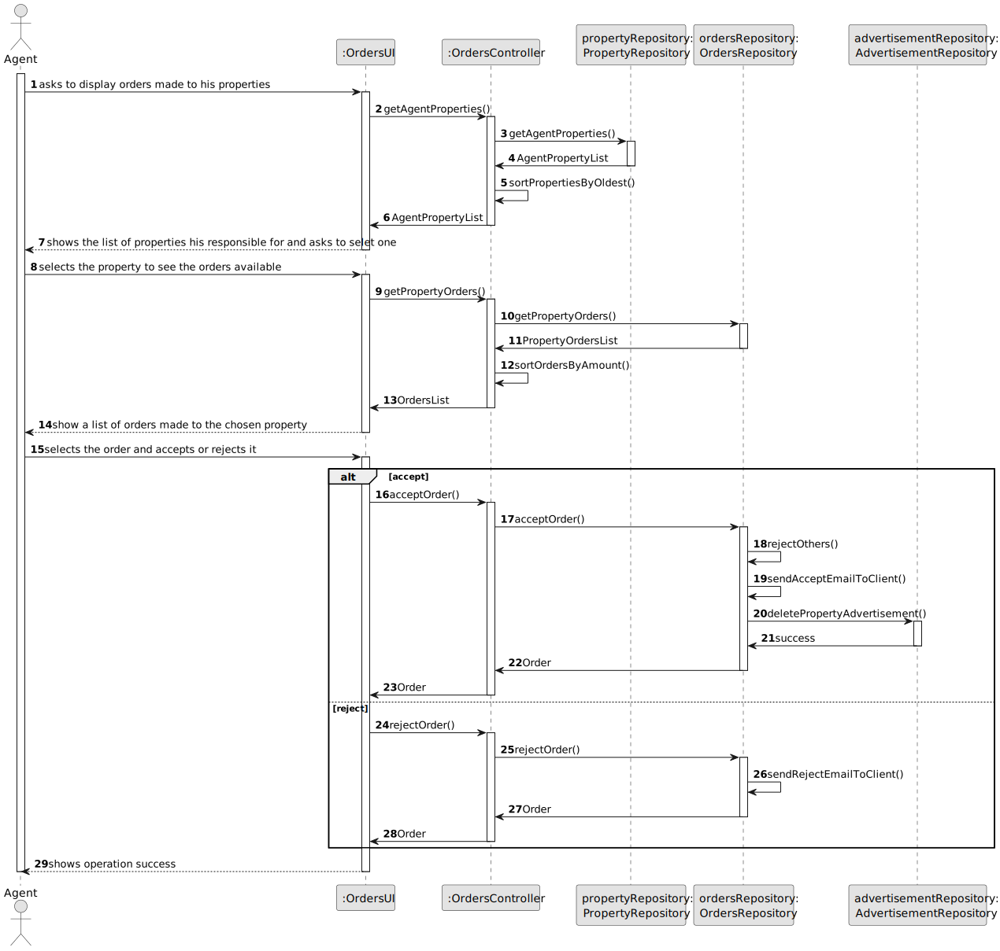
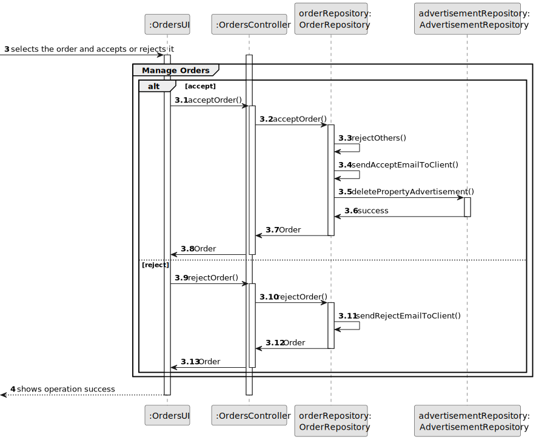
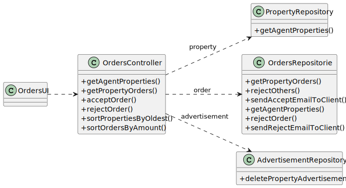

# US 001 - To display listed properties 

## 3. Design - User Story Realization 

### 3.1. Rationale

**SSD - Alternative 1 is adopted.**

| Interaction ID                                                                | Question: Which class is responsible for...  | Answer                  | Justification (with patterns)                                                                                 |
|:------------------------------------------------------------------------------|:---------------------------------------------|:------------------------|:--------------------------------------------------------------------------------------------------------------|
| Step 1 Asks to display orders made to his properties 	                        | 	... interacting with the actor?             | OrdersUI                | Pure Fabrication: there is no reason to assign this responsibility to any existing class in the Domain Model. |
| 			  		                                                                       | 	... coordinating the US?                    | OrdersController        | Controller                                                                                                    |
| Step 2 Shows the list of properties his responsible for and asks to selet one | ... show list of properties for the actor ?	 | PropertiesRepository    | IE: owns its data.                                                                                            |
| Step 3 Selects the property to see the orders available	                      | 	...                                         |                         |                                                                                                               |
| Step 4 Show a list of orders made to the chosen property 		                   | 	... show list of orders for the actor?      | OrderRepository         | IE: owns its data.                                                                                            |
| Step 5 Selects the order and accepts or rejects it		                          | 	... interacting with the actor?             | OrdersUI                | Pure Fabrication: there is no reason to assign this responsibility to any existing class in the Domain Model. |
| 			  		                                                                       | 	... coordinating the US?                    | OrderRepository         | IE: owns its data.                                                                                            |
| 			  		                                                                       | 	... deleting the advertisement?             | AdvertisementRepository | IE: owns its data.                                                                                            |
| Step 6 Shows operation success		                                              | ...  interacting with the actor?             | OrdersUI                | Pure Fabrication: there is no reason to assign this responsibility to any existing class in the Domain Model. |

### Systematization ##

According to the taken rationale, the conceptual classes promoted to software classes are: 

 * PropertiesRepository
 * OrdersRepository
 * AdvertisementRepository

Other software classes (i.e. Pure Fabrication) identified: 

 * OrdersUI 
 * OrdersController

## 3.2. Sequence Diagram (SD)

### Alternative 1 - Full Diagram

This diagram shows the full sequence of interactions between the classes involved in the realization of this user story.

**Manage Orders Partial SD**

## 3.3. Class Diagram (CD)

