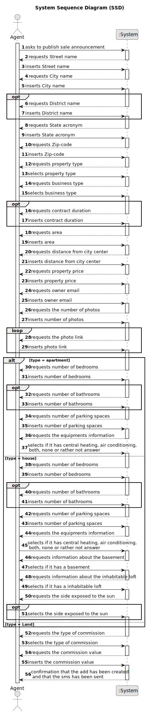

# US 002 - To publish sale announcement 

## 1. Requirements Engineering

### 1.1. User Story Description

As an agent, I can publish any sale announcement on the system, for
example received through a phone call.

### 1.2. Customer Specifications and Clarifications 

**From the specifications document:**

>	"The owner provides property characteristics and the requested price and sends the request to an agent."

>	"The real estate agent reviews advertisement requests, registers the information in the system and
publishes the offer so that it is visible to all clients who visit the agency and use the application"

**From the client clarifications:**

> **Question:** Can an Agent work in more than 1 store (Multiple stores)?
>  
> **Answer:** No.

> **Question:** After the Agent confirms the offer can it be canceled in the application ?
>
> **Answer:** No.
 

> **Question:** How does the agent determine whether it is a fixed commission or a percentage commission?
>
> **Answer:** The agent should choose the type of commission and enter the value.
 

> **Question:** Is the phone call the only way the agent can receive the sale announcement? Or he can receive them via e-mail/letter/etc
>
> **Answer:** For now this is the only way.
 

> **Question:** Also, must the agent who reviews and publishes an advertisement request be the same agent who accepts or rejects the purchase/lease request for that listing?
>
> **Answer:** The agent that receives the request is the one that posts the announcement.

> **Question:** Should we consider that, until the request is reviewed and posted, the request stays in a "not published" state?
>
> **Answer:** This is an implementation detail. For me, as a client, I want the feature implemented as I already described in the project description.

> **Question:** When the request arrives at the agent, are all the essential characteristics of the property in question already present?
>
> **Answer:** Yes.

> **Question:** Is it necessary to publish the owner attributes on the sale announcement?
>
> **Answer:** No.

> **Question:** Are there any acceptance criteria for the agent to accept/reject an order for sale? When the agent asks to open a list of orders for sale (in the system) are these separated by some criteria, for example, the type of property, or all orders are together?
>
> **Answer:** In the beginning of Sprint C we will introduce new requirements that will clarify your questions.

> **Question:** Is it mandatory for the agent to input the commission value before publishing an announcement?
>
> **Answer:** Yes.

> **Question:**  Do requests have any reference/code identifying them with any specific format? What about descriptions (any restrictions, like character limit)? Does that reference carry out with the advertisement?
>
> **Answer:** Please choose appropriate data formats for the request. You are a team of experts and you should choose appropriate formats. In the next sprints I will specify some data formats.
 
 
> **Question:** When the agent receives the phone call (as mentioned in US002) is it the agent who registers the order in the system or has the order already been entered into the system by the owner? Or is the phone call just for the owner to tell the agent that he registered a request in the system?
>
> **Answer:** The agent registers the order in the system.
 
 
> **Question:** What are the attributes of an announcement? Should the announcement have a publication date, and a defined type of announcement embeded (sale or rent)?
>
> **Answer:** Please check the project description available in moodle. Please show the publication date.
 
 
> **Question:** In USS02 are all the criteria for publishing the sale of a property in the system mandatory, or is there any data that the owner can choose not to give? such as not saying the direction of sun exposure in the case of a house.
>
> **Answer:**  The number of bathrooms, the available equipment and the sun exposure are not mandatory. At least one photograph is required.
  
 
> **Question:** Also, since the only way that an agent can receive sale announcement request is through a phone call, wouldn't that contradict what was stated in the project description: "Owners go to one of the company's branches and meet with a real estate agent to sell or rent one or more properties, or they can use the company's application for the same purposes."?
>
> **Answer:** US2: As an agent, I can publish any sale announcement on the system, for example received through a phone call. For example...

 
> **Question:** What would be the attributes of the Owner and Agent?
>
> **Answer:** The Owner attributes are: the name, the citizen's card number, the tax number, the address, the email address and the contact
telephone number. The Agent is an employee of the company.

> **Question** No question
>
> **Answer:** In US2 the agent should identify, in the system, the owner that wants to sell a property. The agent should use the owner e-mail address to identify the owner. The owner who is contacting the agent (for example, through a phone call) must be registered in the system. The agent that receives the phone call is the property responsible agent.

> **Question** Regarding US002, the client previously stated that if the announcement is made through a phone call between the Owner and the agent, the Owner´s information wasn't needed, and therefore it wasn't recorded in the system. My question is whether this decision still applies even with the introduction of US007 (client/user registration)?
>
> **Answer:** "The agent should identify, in the system, the owner that wants to sell a property. The agent should use the owner e-mail address to identify the owner. The owner who is contacting the agent (for example, through a phone call) must be registered in the system. The agent that receives the phone call is the property responsible agent."

> **Question** In US002, does the agent only register the request in the system that he receives from the owner in a phone call, or can he (the agent) also accept/reject requests that the owner registers in the system (without a phone call)?
>
> **Answer:** The agent only publishes the sale announcement that he receives from the owner in a phone call.
In a previous post I also said that the agent that receives the phone call is the property responsible agent.

> **Question** Will we need to implement Java FX for this US, despite it already being built for console?
>
> **Answer:** US2 is a US from Sprint A. Therefore you do not need to implement a Graphical User Interface (GUI) for this US. The GUI requirement is only for USs introduced in Sprint D.

> **Question** In the Acceptance Criteria number 2 of the new refinement to the US002, it is stated that "The notification must include the property identification...". Is this property identification the address of said property or something else?
>
> **Answer:** Yes, the identification is the property address.

> **Question** Are the SMSs created the same way as the emails? The emails are made through a text file, are the SMS notifications the same way?
>
> **Answer:** A file named SMS.txt should be used.

> **Question** Which number should be used to send the SMS, the responsible agent's number or the agency where the agent works?
>
> **Answer:** The responsible agent phone number.

> **Question** In the Project description, there are only specifications for a Sale. What are the required characteristics for a rental?
>
> **Answer:** The caracteristics for a rental are the same as the ones for the sale of a property. The rent value is per month. Additionally, we have to define the contract duration.

> **Question** About the agent comission. What is the value for the fixed amount comission? Is it the same for all agents?
>
> **Answer:** I already answered this question. The commission is for the agency and for that given property.

> **Question** If the comission is percentage[/value] what is the value? Is it the same for all agents?
>
> **Answer:** There is no maximum and the minimum is 0. The commission is for the agency and for that given property.

> **Question** If it's a property for lease is the comission value adjusted for the monthly value and contract duration? What is the value or method for calculating the comission?
>
> **Answer:** The commission is one value/percentage paid when the transaction is made.

### 1.3. Acceptance Criteria

* **AC1:** The commission value includes the agent and the company commission.
* **AC2:** There's only two types of commission: fixed and percentage.
* **AC3:** The street should be requested.
* **AC4:** The city should be requested.
* **AC5:** The district should be requested but, it's optional.
* **AC6:** The state acronym should be requested.
* **AC7:** The zip-code should be requested.
* **AC8:** The zip-code must have exactly 5 digits.
* **AC9:** The property type should be requested.
* **AC10** The property type must be land, house or apartment.
* **AC11:** The type of business (rent/buy) should be requested.
* **AC12:** The area should be requested.
* **AC13:** The area should be in square meters.
* **AC14:** The distance from city should be requested.
* **AC15:** The distance from city should be in meters.
* **AC16:** The property price should be requested.
* **AC17:** The property price should be in US Dollars.
* **AC18:** The number of bedrooms should be requested.
* **AC19:** The number of bathrooms should be requested, but it's optional.
* **AC20:** The number of parking spaces should be requested.
* **AC21:** The information about the existence of a basement should be requested.
* **AC22:** The information about the existence of an inhabitable loft should be requested.
* **AC23:** The information about the side exposed to the sun should be requested, but it's optional.
* **AC24:** The owner email should be requested.
* **AC25:** The owner email should be in the format 'example@example.ex'.
* **AC26:** The owner email should already be registered in the system.
* **AC27:** The photographs should be requested.
* **AC28:** The minimum photograph num is 1 and maximum 30.
* **AC29:** The equipment should be requested, but it's optional.
* **AC30:** The type of commission should be requested.
* **AC31:** The commission value should be requested.
* **AC32:** After the Agent confirms the offer it cant be canceled.
* **AC33:** The agent should identify, in the system, the owner that wants to sell a property. The agent should use the owner e-mail address to identify the owner. The owner who is contacting the agent (for example, through a phone call) must be registered in the system. The agent that receives the phone call is the property responsible agent.
* **AC34:** The agent that receives the phone call is the property responsible agent.
* **AC35:** A file named SMS.txt should be used.
* **AC36:** The contract duration should be requested if it is a rent.
* **AC37:** The contract duration should be in months.
* **AC38:** An SMS notification should be sent to the owner when the listing of the
    property becomes available.
* **AC39:** The notification must include the property identification and the date it
  became available.
* **AC40:** The Notification must include the name and phone number of the
  responsible Agent.

### 1.4. Found out Dependencies

* There is a dependency to "US003 As a system administrator, I want to register a new employee." since an agent is an employee which is registered by a system administrator.
* There is a dependency to "US006 As a system administrator, I want to specify states, districts and cities in the
  system." since 
* There is a dependency to "US007: As an unregistered user, I want to register in the system to buy, sell or rent
  properties." because the agent must be registered to publish a sale announcement.

### 1.5 Input and Output Data

**Input Data:**

* Typed data:
	* Street name
      * City name
      * District name
      * State acronym
      * Zip-code
      * Contract duration
      * Area
      * Distance from city center
      * Property price
      * Number of bedrooms
      * Number of bathrooms
      * Number of parking spaces
      * Commission value
      * Number of photos
      * Photo link
  
	
* Selected data:
  * the property type (land/house/apartment)
  * the business type (sale/lease)
  * if there is a basement (yes/no)
  * if there is an inhabitable loft (yes/no)
  * the side exposed to the sun (north/south/west/east)
  * commission type (fixed/percentage)
  * Equipment information

**Output Data:**

* (In)Success of the operation

### 1.6. System Sequence Diagram (SSD)

### 1.7 Other Relevant Remarks

