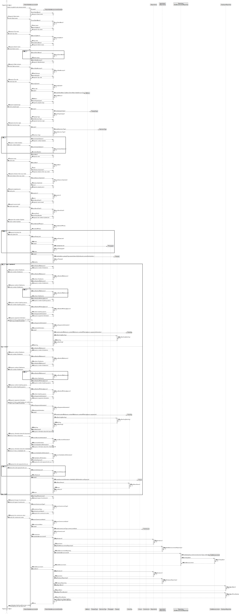
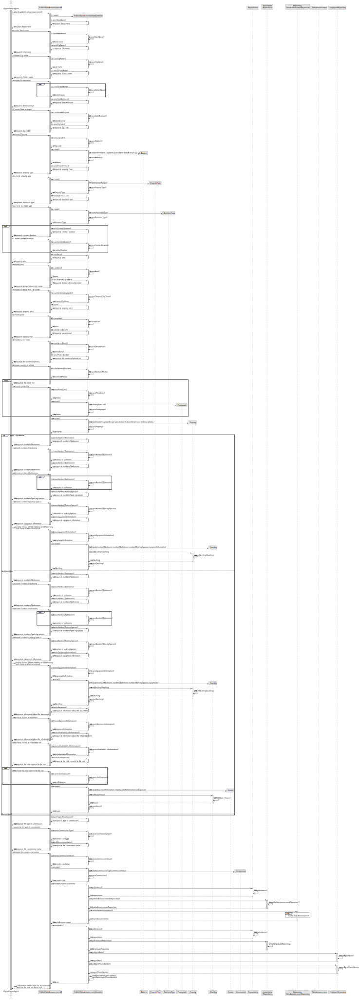
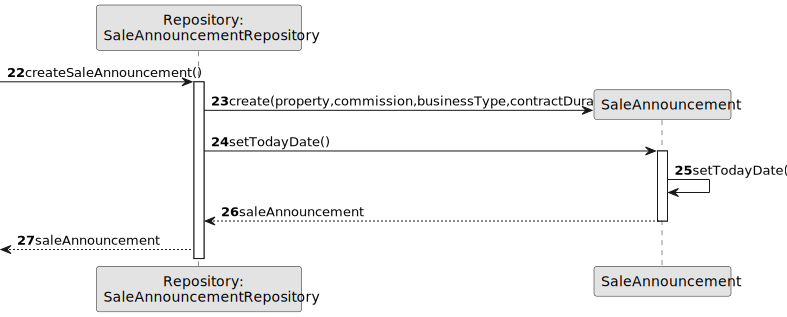
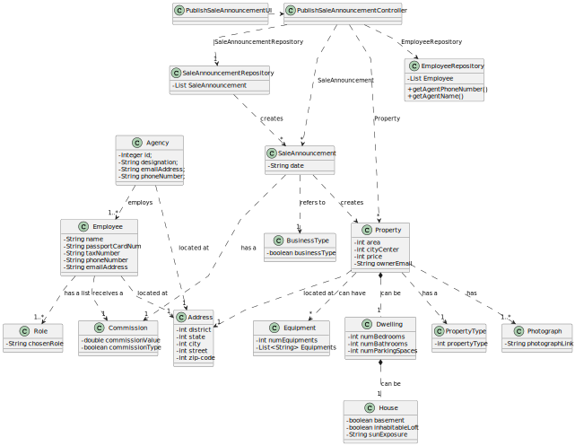

# US 002 - Publish sale announcement

## 3. Design - User Story Realization 

### 3.1. Rationale

**SSD - Alternative 1 is adopted.**

| Interaction ID | Question: Which class is responsible for...   | Answer                            | Justification (with patterns)                                                                                 |
|:---------------|:----------------------------------------------|:----------------------------------|:--------------------------------------------------------------------------------------------------------------|
| Step 1  		     | 	... interacting with the actor?              | PublishSaleAnnouncementUI         | Pure Fabrication: there is no reason to assign this responsibility to any existing class in the Domain Model. |
| 			  		        | 	... coordinating the US?                     | PublishSaleAnnouncementController | Controller                                                                                                    |
| 			  		        | 	... instantiating a new SaleAnnouncement?    | Agent                             | Creator (Rule 1): in the DM Agent publishes a SaleAnnouncement.                                               |
| 			  		        | ... knowing the user using the system?        | UserSession                       | IE: cf. A&A component documentation.                                                                          |
| Step 2  		     | 	...saving the inputted data?                 | SaleAnnouncement                  | IE: object created in step 1 has its own data.                                                                |
| Step 3  		     | 	...knowing the property types to show?       | PublishSaleAnnouncement           | IE: Property types are defined by the Agent.                                                                  |
| Step 4  		     | 	... saving the selected category?            | SaleAnnouncement                  | IE: object created in step 1 is classified in one type.                                                       |
| Step 5  		     | 	... validating all data                      | SaleAnnouncement                  | IE: owns its data.                                                                                            | 
| 			  		        | 	... validating all data | Agent                             | IE: knows all its Sale announcements.                                                                         | 
| 			  		        | 	... saving the created task?                 | Agent                             | IE: owns all its Sale announcements.                                                                          | 
| Step 6  		     | 	... informing operation success?             | PublishSaleAnnouncementUI         | IE: is responsible for user interactions.                                                                     | 

### Systematization ##

According to the taken rationale, the conceptual classes promoted to software classes are: 

* SaleAnnouncement
* Commission
* Employee
* Agency
* Role
* Property
* BusinessType
* Dwelling
* House
* PropertyType
* Address
* Photograph
* Equipment

Other software classes (i.e. Pure Fabrication) identified: 

 * PublishSaleAnnouncementUI  
 * PublishSaleAnnouncementController

## 3.2. Sequence Diagram (SD)

### Alternative 1 - Full Diagram

This diagram shows the full sequence of interactions between the classes involved in the realization of this user story.

### Alternative 2 - Split Diagram

This diagram shows the same sequence of interactions between the classes involved in the realization of this user story, but it is split in partial diagrams to better illustrate the interactions between the classes.

It uses interaction occurrence.

**Create Sale Announcement**

## 3.3. Class Diagram (CD)

