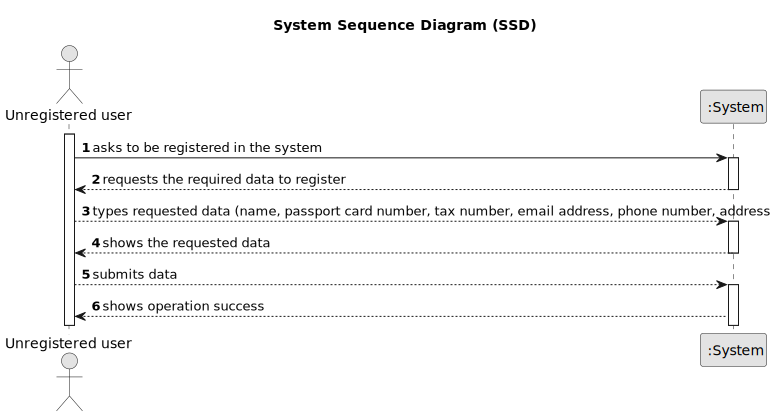

# US 007 - Register to buy, sell or rent properties

## 1. Requirements Engineering

### 1.1. User Story Description

As an unregistered user, I want to register in the system to buy, sell or rent properties.

### 1.2. Customer Specifications and Clarifications 

**From the specifications document:**

>	Among these operations are the publication of rental and sale advertisements, the registration of a business (lease or sale) and the scheduling and registration of visits to the property. (...) When the client decides to buy/rent the property, he sends a request for the purchase/lease of the property to the agent. 

**From the client clarifications:**

> **Question:** Does the user also receive the password via email or can he choose a password when registering?
>  
> **Answer:** The owner can choose a password when registering.

> **Question:** When an unregistered user wants to register a new account in the system, the set of parameters that are asked are the following: name, citizen card number, tax number, email, phone number, and password. Do you want any extra parameters/requirements to be asked or just the ones specified above? If so, which ones are mandatory?
>
> **Answer:** The Owner attributes are: the name, the citizen's card number, the tax number, the address, the email address and the contact telephone number. The address of the owner is not mandatory.

> **Question:** It was previously stated that an unregistered user could do a property listing request. However, with the introduction of US007, I want to clarify and make sure that now a user needs to be registered in order to buy, sell or rent properties, or if they can still do it unregistered.
>
> **Answer:** In Sprint B we introduce US7 and now, in US4, the owner needs to be registered in the system to submit a request for listing. You should update all artifacts to include this change.

> **Question:** When registering a user, should the application ask if they are registering as a client or an Owner?
>
> **Answer:** No. When registering a user, in US7, we are registering a user that can buy, sell or rent properties. After registering, when this user logins in the system, the user should have access to both owner and client functionalities.

> **Question:** You said that the owner can choose a password, but how many letters, numbers... it needs to have?
>
> **Answer:** In the Project Description we get: "All those who wish to use the application must be authenticated with a password of seven alphanumeric characters, including three capital letters and two digits". Please read the documentation and clarifications made by the client.

> **Question:** In a question earlier you presented the owner attributes. Does the client have different attributes?
> 
> **Answer:** A owner is also a client of the Real Estate USA company. The attributes are the same. This distinction between owner and client intends to make an association with the type of business. The Owner sells and provides properties for renting and the client buys and rents properties. Again, when the user (registered in US7) logins in the system, the user should have access to both owner and client functionalities.

> **Question:** When a user registers in the system, does it need to specify for which transactional activities or all registered users can buy sell and rent?
> 
> **Answer:** All registered users can buy sell and rent.

> **Question:** After the users fills all the required information, is the user automatically registered in the system, or is there any other role that will review and approve the user registration?
> 
> **Answer:** The system should automatically validate the registration.

> **Question:** When a user starts a registration, does the application need to validate if the data is valid (for example: blank text box, email without @, etc)?
> 
> **Answer:** Data validation is always a good practice.

### 1.3. Acceptance Criteria

* **AC1:** All required fields must be filled in except the address.
* **AC2:** The passport card number must have 9 digits.
* **AC3:** The tax number must have 9 digits.
* **AC4:** For the address, the street name, the city name and the district name must have at least 1 alpha chars each, the state acronym must have at least 1 alpha character, the state zip code must have 5 digits.
* **AC5:** The email address minimal length resolves to 3 characters.
* **AC6:** The contact telephone number need to have 10 digits.

### 1.4. Found out Dependencies

* There is a dependency to "US004 - To submit a request for listing a property" since the unregistered user needs to be registered as a client to sell properties.

### 1.5 Input and Output Data

**Input Data:**

* Typed data:
  * the name
  * the passport card number
  * tax number
  * the email address
  * the phone number
  * the address

**Output Data:**
* (In)Success of the operation

### 1.6. System Sequence Diagram (SSD)

### 1.7 Other Relevant Remarks

n/a