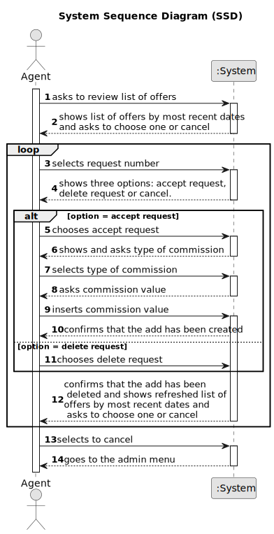

# US 008 - List requests and post

## 1. Requirements Engineering

### 1.1. User Story Description

As an agent, I intend to see the list of property announcement requests made
to myself, so that I can post the announcement.

### 1.2. Customer Specifications and Clarifications 

**From the specifications document:**

>  The owner provides property characteristics and the requested price and sends the request to an agent.

> In the case of a request for the sale of a
property, the owner must provide information on: the type of property (apartment, house or land),
the area in m2, the location, the distance from the city centre, the requested price and one or more
photographs.

> If the property is an apartment or a house, the owner also provides: the number of
bedrooms, the number of bathrooms, the number of parking spaces and the available equipment,
such as central heating and/or air conditioning. In case the property is a house, the existence of a
basement, an inhabitable loft, and sun exposure must be registered as well.

>The real estate agent reviews advertisement requests, registers the information in the system and
publishes the offer so that it is visible to all clients who visit the agency and use the application 

**From the client clarifications:**

> **Question:** When displaying the property announcement requests in the system to the agent besides them being ordered from most recent to oldest is there a need to display the specific day where the requests were published?
>
> **Answer:** The list of property announcement requests should be sorted by the date they were created, with the most recent requests appearing first. The system should show the date when the property announcement requests was made.

> **Question:** Can the agent select multiple requests at the same time?
>
> **Answer:** No. The agent can only post one announcement at a time.

> **Question:** Regarding US008, can the agent decline an announcement request?
>
> **Answer:** Yes. The agent must include a message justifying the rejection.

> **Question:** Is the owner responsible to assigning the property to an agent or there are other ways to do that?
> 
> **Answer:** In US8 we get "As an agent, I intend to see the list of property announcement requests made to myself, so that I can post the announcement". In this US the agent is the actor.

> **Question:** In this US8, will it be necessary to show search criteria? If so, which ones?
>
> **Answer:** There is no search criteria.

> **Question:** Does the customer have any say in setting the commission (agree or deny, eg: commission too high so I withdraw the ad request) or is the commission solely set by the agent without customer approval?
>
> **Answer:** The agent should, firstly, set the commission and then publishes the offer in the system. The sale price (the USD value that is shown in the announcement) should include the commission value (owner requested price + commission) and should not show the commission. The commission is only specified when the agent accepts the request.

> **Question:** About US08, since as an agent I intend to see the advertisement requests made to me in order to publish the chosen advertisement after consulting the list, why should there be an option to reject it since the previously chosen advertisement had already the intention of being published.The rejection operation shouldn't be described as another feature?
>
> **Answer:** I want to check all property announcement requests and have the option to accept or reject any announcement request. The property owner is a human being and can make errors like any other human being...

### 1.3. Acceptance Criteria

* **AC1:** The list of property announcement requests should be sorted by the date
  they were created, with the most recent requests appearing first.
* **AC2** An announcement is posted when a request is accepted. The list of requests
  should be refreshed, and that request should not be shown again.
* **AC3** The system should show the date when the property announcement requests was made.
* **AC4** The agent can only post one announcement at a time.
* **AC5** The agent must include a message justifying the rejection.
* **AC6** The agent that accepts the request must be the responsible agent for the property announcement
* **AC7** There is no search criteria.
* **AC8** The agent should, firstly, set the commission and then publishes the offer in the system.
* **AC9** The sale price (the USD value that is shown in the announcement) should include the commission value (owner requested price + commission).
* **AC10** The commission should not be shown.
* **AC11** The commission is only specified when the agent accepts the request.
* **AC12** The list of requests should be shown.
* **AC13** The number of the property should be selected.
* **AC14** Options between accept and delete show be selected.
* **AC15** If the request is accepted the commission type should be chosen.
* **AC16** A confirmation message (about the creation of the announcement ou/and the request deleted from the list) should be received.
* **AC17** A option to cancel should be available.

### 1.4. Found out Dependencies

* There is a dependency to "US2: As an agent, I can publish any sale announcement on the system, for
  example received through a phone call." because the agent has the option to publish a sale announcement
  from the list of requests.

* There is a dependency to "US3: As a system administrator, I want to register a new employee." because
  the user has to be registered as an employee (agent) to access the list of requests.

* There is a dependency to "US4: As an owner, I intend to submit a request for listing a property sale or rent,
  choosing the responsible agent." because the agent has to see the list of requests created in this US.

### 1.5 Input and Output Data

**Input Data:**

* Typed data:
  * The justification message (if a request is deleted)
  * Commission value
	
* Selected data:
    * The chosen request
    * Options between accept request or decline request
    * The cancel option if wanted 
    * Commission type

**Output Data:**
* List of requests
* Instruction message
* Options: cancel,accept request or decline request
* Success message

### 1.6. System Sequence Diagram (SSD)

### 1.7 Other Relevant Remarks

n/a