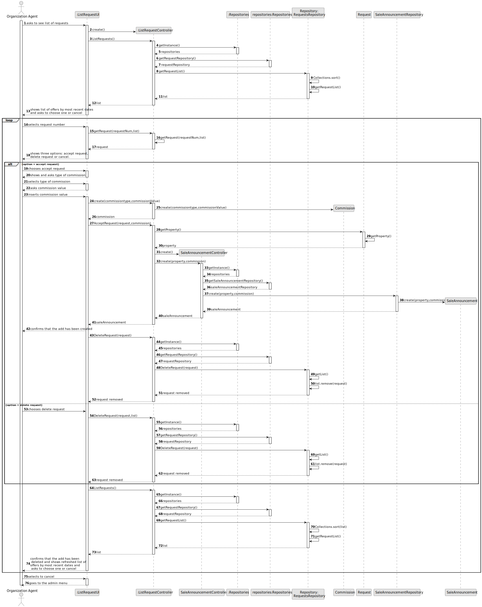
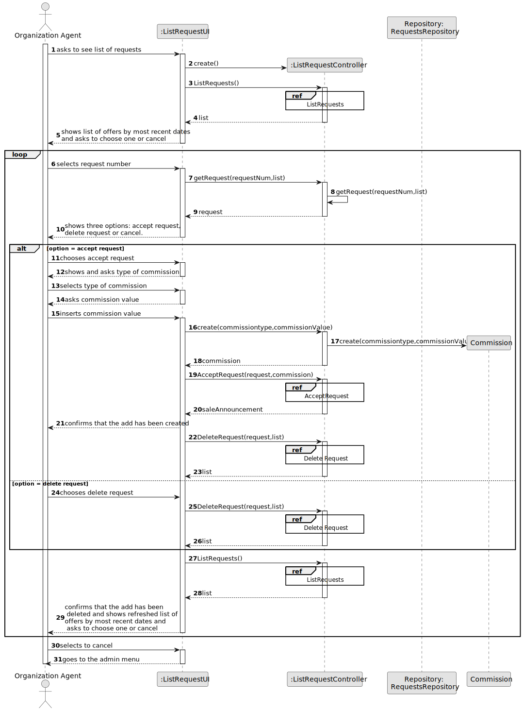
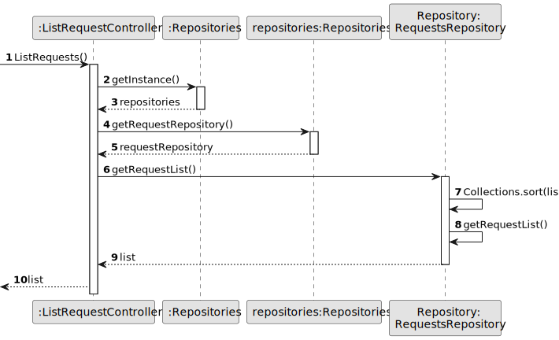
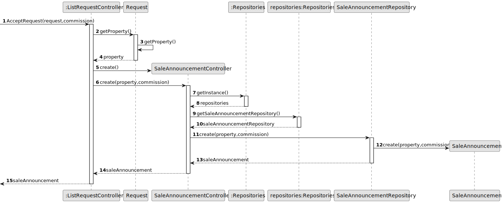
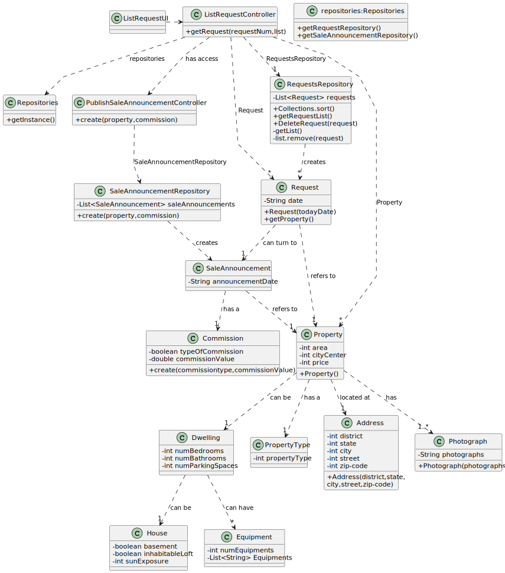

# US 008 - To display listed properties 

## 3. Design - User Story Realization 

### 3.1. Rationale

**SSD - Alternative 1 is adopted.**

| Interaction ID                                                                                                                                                                                                                                                                                                                                                                                                                                                                                                                                                                                                                                       | Question: Which class is responsible for...                         | Answer                                                              | Justification (with patterns)                                         |
|:-----------------------------------------------------------------------------------------------------------------------------------------------------------------------------------------------------------------------------------------------------------------------------------------------------------------------------------------------------------------------------------------------------------------------------------------------------------------------------------------------------------------------------------------------------------------------------------------------------------------------------------------------------|:--------------------------------------------------------------------|:--------------------------------------------------------------------|:----------------------------------------------------------------------|
| Step 1 - Ask to see the list of property announcements	                                                                                                                                                                                                                                                                                                                                                                                                                                                                                                                                                                                              | ... interacting with the actor?	                                    | AnnouncementRequestUI                                               | 	Pure Fabrication.                                                    |
 |                                                                                                                                                                                                                                                                                                                                                                                                                                                                                                                                                                                                                                                      | ... coordinating the US?	                                           | AnnouncementRequestController                                     	 | Controller                                                            |
|                                                                                                                                                                                                                                                                                                                                                                                                                                                                                                                                                                                                                                                      | ... obtaining a list of property announcement requests?	            | AnnouncementsListRepository	                                        | IE: knows all announcement requests.                                  |
|                                                                                                                                                                                                                                                                                                                                                                                                                                                                                                                                                                                                                                                      | ... publishing a new Property?	                                     | Agent                                                               | 	Agent should be able to publish any sale announcement on the system. |              
| Step 2 - selecting an announcement	                                                                                                                                                                                                                                                                                                                                                                                                                                                                                                                                                                                                                  | ...selecting what announcement to reject/accept?                    | 	Agent	                                                             | Agent is responsible to select the announcement to accept/reject.     |
| Step 3 - repositories	                                                                                                                                                                                                                                                                                                                                                                                                                                                                                                                                                                                                                               | ... sorting announcement requests by date?	                         | PropertyAnnouncements	                                              | IE: knows all Announcement Request dates.                             |
|                                                                                                                                                                                                                                                                                                                                                                                                                                                                                                                                                                                                                                                      | ... adding property to PropertiesRepository if accepted?	           | AnnouncementRequestController                                       | 	Pure fabrication.                                                    |
|                                                                                                                                                                                                                                                                                                                                                                                                                                                                                                                                                                                                                                                      | ... removing announcement request from the AnnouncementsRepository? | 	AnnouncementRequestController	                                     | Pure fabrication.                                                     |
| Step 4 - shows data	...                                                                                                                                                                                                                                                                                                                                                                                                                                                                                                                                                                                                                              |  sending a refreshed list of announcements?	                        | AnnouncementRequestUI                                               | 	IE: is responsible for user interactions.                            |
|                                                                                                                                                                                                                                                                                                                                                                                                                                                                                                                                                                                                                                                      | ...informing operation success?	| AnnouncementRequestUI| 	IE: is responsible for user interactions.                            |                                                                       

### Systematization ##

According to the taken rationale, the conceptual classes promoted to software classes are: 

 * Property
 * Filters

Other software classes (i.e. Pure Fabrication) identified: 

 * ListPropertiesUI 
 * ListPropertiesController

## 3.2. Sequence Diagram (SD)

### Alternative 1 - Full Diagram

This diagram shows the full sequence of interactions between the classes involved in the realization of this user story.

### Alternative 2 - Split Diagram

This diagram shows the same sequence of interactions between the classes involved in the realization of this user story, but it is split in partial diagrams to better illustrate the interactions between the classes.

It uses interaction occurrence.

**List Request**

**Accept Request**

## 3.3. Class Diagram (CD)

