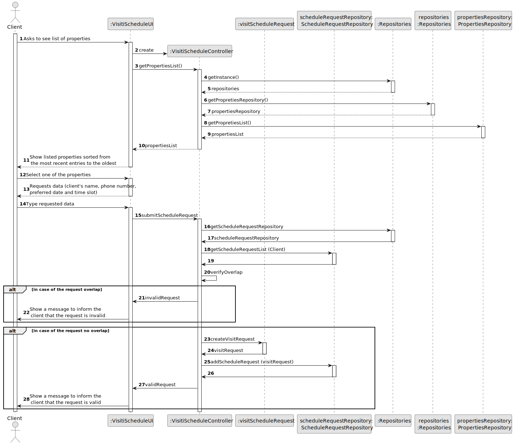

# US 001 - To display listed properties 

## 3. Design - User Story Realization 

### 3.1. Rationale

**SSD - Alternative 1 is adopted.**

| Interaction ID                      | Question: Which class is responsible for...      | Answer                   | Justification (with patterns)                                                                                 |
|:------------------------------------|:-------------------------------------------------|:-------------------------|:--------------------------------------------------------------------------------------------------------------|
| Step 1 	                            | 	... interacting with the actor?                 | VisitiScheduleUI         | Pure Fabrication: there is no reason to assign this responsibility to any existing class in the Domain Model. |
 |                                     | ... coordinating the US?                         | VisitiScheduleController | controller                                                                                                    |
| Step 2: Shows a list of properties  | ... displaying the list?                         | VisitiScheduleUI         | IE: interacts with the user                                                                                   |
|                                     | ...who is responsible for choosing the property? | User                     | IE                                                                                                            |
| Step 3: Requests data               | ...displaying the UI for the User to input data?  |VisitiScheduleUI                           | Pure Fabrication                                                                                                               |
| Step 4: Submit Schedule Request     | ...Validating Request?                           | scheduleRequestRepository                         | IE                                                                                                            |
| Step 5: Check if request overlap    | ... Check if the request doesent overlap?        | VisitiScheduleController                         | Controller                                                                                                    |                                                                                     | 
| Step 6: Shows operation success  		 | ... informing operation success?                 | VisitiScheduleUI         | IE: is responsible for user interactions.                                                                     | 

### Systematization ##

According to the taken rationale, the conceptual classes promoted to software classes are: 

 * User
 * VisitSchedule

Other software classes (i.e. Pure Fabrication) identified: 

 * VisitScheduleUI 
 * VisitScheduleController

## 3.2. Sequence Diagram (SD)

### Alternative 1 - Full Diagram

This diagram shows the full sequence of interactions between the classes involved in the realization of this user story.

### Alternative 2 - Split Diagram

This diagram shows the same sequence of interactions between the classes involved in the realization of this user story, but it is split in partial diagrams to better illustrate the interactions between the classes.

It uses interaction occurrence.

**Get Properties List**

**Schedule Request List**

**Create Visit Request**

## 3.3. Class Diagram (CD)

