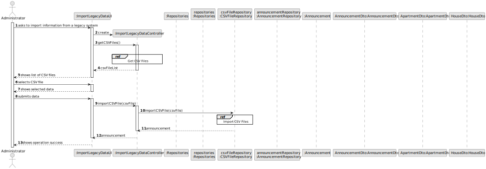

# US 012 - To import information from legacy system 

## 3. Design - User Story Realization 

### 3.1. Rationale

**SSD - Alternative 1 is adopted.**

| Interaction ID                                              | Question: Which class is responsible for...                               | Answer                     | Justification (with patterns)                                                                                 |
|:------------------------------------------------------------|:--------------------------------------------------------------------------|:---------------------------|:--------------------------------------------------------------------------------------------------------------|
| Step 1: asks to import information from a legacy system 	   | 	... interacting with the actor?                                        | ImportLegacyDataUI         | Pure Fabrication: there is no reason to assign this responsibility to any existing class in the Domain Model. |
| 			  		                                           | 	... coordinating the US?                                               | ImportLegacyDataController | Controller                                                                                                    |
|                                                             | ... obtaining the csv files list?                                         | CSVFileRepository          | IE and Pure Fabrication                                                                                       |
| Step 2: shows list of CSV files                             | ... show the list of csv files?                                           | ImportLegacyDataUI         | Pure Fabrication: there is no reason to assign this responsibility to any existing class in the Domain Model. |
| Step 3: selects CSV file	                                   | 	... validating selected data?                                          | ImportLegacyDataUI         | Pure Fabrication: there is no reason to assign this responsibility to any existing class in the Domain Model. |
|                                                             | ... temporarily keeping the selected data?                                | ImportLegacyDataUI         | Pure Fabrication: there is no reason to assign this responsibility to any existing class in the Domain Model. |
| Step 4: shows selected data 		                           | 	... display all the information before submiting?                      | ImportLegacyDataUI         | Pure Fabrication: there is no reason to assign this responsibility to any existing class in the Domain Model. |
| Step 5: submits data		                                   | 	... validating all data (local validation)?                            | Announcement               | IE: owns its data.                                                                                            |
|                                                             | ... validating all data (global validation)?                              | AnnouncementRepository     | IE: knows all its announcements.                                                                              |
|                                                             | ... instantiating a new Announcement (based on the csv file information)? | AnnouncementRepository     | IE: owns all announcements.                                                                                   |
|                                                             | ... keeping data about the Announcement?                                  | AnnouncementDto            | IE and Pure Fabrication.                                                                                      |
| Step 6: shows operation success		                       | ... informing operation success?                                          | ImportLegacyDataUI         | IE: is responsible for user interactions.                                                                     | 

### Systematization ##

According to the taken rationale, the conceptual classes promoted to software classes are: 

 * Announcement

Other software classes (i.e. Pure Fabrication) identified: 

 * ImportLegacyDataUI 
 * ImportLegacyDataController
 * CSVFileRepository
 * AnnouncementRepository
 * AnnouncementDTO

## 3.2. Sequence Diagram (SD)

### Alternative 1 - Full Diagram

This diagram shows the full sequence of interactions between the classes involved in the realization of this user story.

### Alternative 2 - Split Diagram

This diagram shows the same sequence of interactions between the classes involved in the realization of this user story, but it is split in partial diagrams to better illustrate the interactions between the classes.

It uses interaction ocurrence.

**Get Task Category List Partial SD**

**Get Task Category Object**

**Get Employee**

**Create Task**

## 3.3. Class Diagram (CD)

