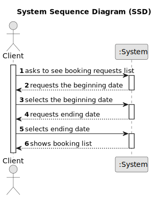

# US 015 - List Booking requests

## 1. Requirements Engineering

### 1.1. User Story Description

As an agent, I intend to list all booking requests for properties managed by
me.

### 1.2. Customer Specifications and Clarifications 

**From the specifications document:**

> After consulting a list of properties, the client can request to schedule a visit to the real estate agent
for a specific property to verify its conditions. The agent receives the request, checks the
availability and sends the response. If the customer accepts the order, it is automatically scheduled
in the system.

>	After carrying out the visit, the agent records the visit and an indication of whether or not he thinks
the deal will take place.

**From the client clarifications:**

> **Question:** When the agent requests the booking requests list to contact the client, that list should ONLY contain the requests related to that agent?
>
> **Answer:** Yes. Listing is a feature described in US15.
Important: In US15 the Agent gets a list of booking requests (made to him). Then, the agent, may want to respond to the user (as defined in US16). US15 and US16 are executed sequentially. Even so, the agent should be able to see a list of all booking requests made to him (US15) without answer any booking request.

> **Question:** N/A
>
> **Answer:** The sorting algorithm to use should be defined in a configuration file.
Please study ESOFT and discuss your question with ESOFT teatchers. In AC2 of US15 we get "The list of requests must be sorted by date in ascending order. The sorting algorithm to be used by the application must be defined through a configuration file. At least two sorting algorithms should be available."

> **Question:** The US15 does the listing and in US16 we are already responsing to one booking request. That said, were is the selection part being done?
>
> **Answer:** In US15 the Agent gets a list of booking requests (made to him). Then, the agent, may want to respond to the user (as defined in US16). US15 and US16 are executed sequentially. Even so, the agent should be able to see a list of all booking requests made to him (US15) without answer any booking request. In US16 the agent selects the booking request.

> **Question:** Booking is a slightly vague word. Our team wants clarifications on what type of requests the word encompasses (visit requests being our strongest guess, but we are not sure).
>
> **Answer:** It is a visit request

> **Question:** US015's AC1 states that "The list of requests must be shown for a specific period (begin date, end date)". As such, our team would like to know if you want this time period to be selected or typed, and in which format it should be in. 
>
> **Answer:**  The dates should be selected. The format should be DD-MM-YYYY.

> **Question:** In US015's AC1, it is stated that "The list of requests must be shown for a specific period (begin date, end date)."
This time period caused confusion, as the team is unsure whether the "date" is referring to the date chosen by the client in the message (See US009's requirements) or the date of creation of the visit request.
>
> **Answer:** The goal is to use the date chosen by the client (the preferred date that you can see in US9) to list booking requests.	

> **Question:**  One of our questions' answers made us believe there might have been some miscommunication, as it had some significant mistakes in phrasing and your answer wasn't clear enough. As such, here is that same question, in a simpler and clearer way:
US017's AC2 states that "Two sorting algorithms should be implemented (to be chosen manually by the network manager)."
US015's AC2 states that "The list of requests must be sorted by date in ascending order. The sorting algorithm to be used by the application must be defined through a configuration file. At least two sorting algorithms should be available."
As such, the team would like to know if, just like in US017, the sorting methods would be chosen manually in US015.
>
> **Answer:**  In US 15 the sorting algorithm to be used by the application must be defined through a configuration file. This is a diferent strategy from what I want in US17. Please study ESOFT.
 
> **Question:** In AC2, when the suggestion of date and time is sent, is there a standard duration for the visit or is it mandatory to fill in a start time and an end time for the visit?
>
> **Answer:** There is no standard duration to schedule a visit. The client should define his availability specifying the start time and the end time for the visit.

> **Question:** : In AC2, can any time be used or are we limited to certain hours?
>
> **Answer:** Any time can be used.

> **Question:**  Also in AC2, should we use the 12am/pm or 24-hour time format?
>
> **Answer:** Please use 24-hour time format.

> **Question:** When writing the information to schedule a meeting with the agent, the preferred date and the time slot of the visit should be checked. The client can choose any day of the year? And any time of the day?
>
> **Answer:** Any date and time can be specified. We are always available to our customers!

> **Question:** 
>
> **Answer:** 

### 1.3. Acceptance Criteria

* **AC1:** The list of requests must be shown for a specific period (begin date, end
  date).
* **AC2:** The list of requests must be sorted by date in ascending order. The sorting
  algorithm to be used by the application must be defined through a configuration
  file. At least two sorting algorithms should be available.
* **AC3:** The agent should be able to see a list of all booking requests made to him without answer any booking request.
* **AC4:** The sorting algorithm to use should be defined in a configuration file.
* **AC5:** The format should be DD-MM-YYYY.
* **AC6:** The beginning date should be selected.
* **AC7:** The ending date should be selected.
* **AC8:** The date chosen by the client should be used to list booking requests.
* **AC9:** There is no standard duration to schedule a visit.
* **AC10:** Any time can be used.
* **AC11:** Use 24-hour time format.
* **AC12:** Configuration file name should be requested.
* **AC13:** Configuration file should be a text file. 
* **AC14:** This US needs to be implemented with JavaFX.
* **AC15:** Beginning date should be before the ending date.
* **AC16:** The file "sortingAlgorithm.txt" should not be empty.
* **AC17:** The sorting methods available should be know in the configuration file. 

### 1.4. Found out Dependencies

* There is a dependency to US003, because the agent needs to be registered as an Agent in the system to list the booking requests made by him.
* There is a dependency to "US9: As a client, I want to leave a message to the agent to schedule a visit to a
  property of my interest." because the booking requests are made here.
* There is a dependency to "US7: As an unregistered user, I want to register in the system to buy, sell or rent
  properties." because the agent has to be registered in the system see the booking requests.

### 1.5 Input and Output Data

**Input Data:**

* Typed data:
	* N/A
	
* Typed date in File:
    * sorting method name (in configuration file: "sortingAlgorithm,txt")
* Selected data:
    * beginning date
    * ending date

**Output Data:**
* Booking requests list.
* (In)Success of the operation

### 1.6. System Sequence Diagram (SSD)

### 1.7 Other Relevant Remarks

n/a