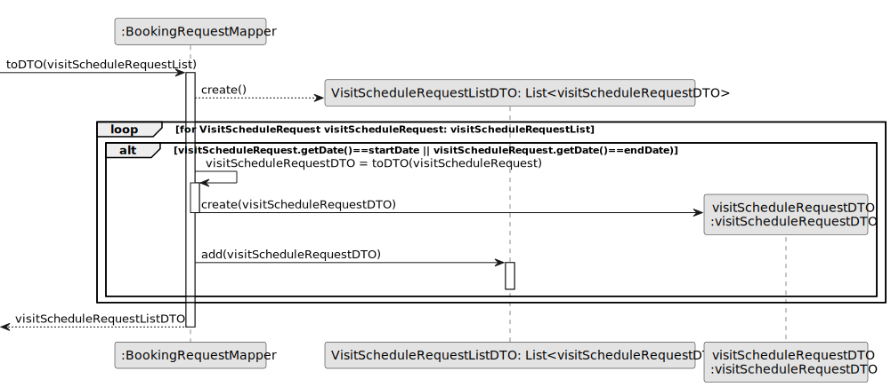

# US 015 - List Booking requests

## 3. Design - User Story Realization 

### 3.1. Rationale

**SSD - Alternative 1 is adopted.**

| Interaction ID                                                     | Question: Which class is responsible for...            | Answer                                                                                                                                                               | Justification (with patterns)                                                                                                          |
|:-------------------------------------------------------------------|:-------------------------------------------------------|:---------------------------------------------------------------------------------------------------------------------------------------------------------------------|:---------------------------------------------------------------------------------------------------------------------------------------|
| Step 1 : asks list the visits requests for properties managed him	 | ... requesting the beginDate?	                         | ListBookingRequestsUI                                                                                                                                                | 	Pure Fabrication - The UI layer is responsible for handling user interactions and requesting input.                                   |
|                                                                    | ... inputing the beginDate?	                           | Agent                                                                                                                                                                | 	Pure Fabrication - The Agent class represents a user or actor responsible for inputting data.                                         |
|                                                                    |  ... requesting the endDate?	                          | ListBookingRequestsController                                                                                                                                        | 	Pure Fabrication - The UI layer is responsible for handling user interactions and requesting input.                                   |
|                                                                    | ... inputing the endDate?	                                         | Agent                                                                                                                                                                | 	Pure Fabrication - The Agent class represents a user or actor responsible for inputting data.                                         |
| Step 2                                                             | ... coordinating the US?	                              | ListBookingRequestsController                                                                                                                                        | 	Controller - The ListBookingRequestsController class is responsible for coordinating use cases and managing the flow of interactions. |
| Step 3                                                             | 	... sorting the booking requests list?	               | SortingMethods                                                                                                                                                       | 	Pure Fabrication - SortingMethods are utility classes responsible for sorting                                                         |
|                                                                    | ... filtering the booking requests to the dates given	 | VisitScheduleRequestRepository                                                                                                                                              | 	Information Expert - The VisitScheduleRequestRepository class handles data storage and retrieval.                                            |
|                                                                    | ... displaying the filtered booking requests	          | ListBookingRequestsUI                                                                                                                                                    | 	Pure Fabrication - The UI layer is responsible for displaying data to the user.                                                       |                                                                                                                                                    

### Systematization ##

According to the taken rationale, the conceptual classes promoted to software classes are: 

* Agent
* User

Other software classes (i.e. Pure Fabrication) identified: 

 * ListBookingRequestsUI
 * ListBookingRequestsController
 * VisitScheduleRequestRepository
 * SortingMethods

## 3.2. Sequence Diagram (SD)

### Alternative 1 - Full Diagram

This diagram shows the full sequence of interactions between the classes involved in the realization of this user story.

### Alternative 2 - Split Diagram

This diagram shows the same sequence of interactions between the classes involved in the realization of this user story, but it is split in partial diagrams to better illustrate the interactions between the classes.

It uses interaction occurrence.

**Get Agent Logged in**

**Get Visit Schedule Request List By Agent**

**List To DTO**

## 3.3. Class Diagram (CD)

