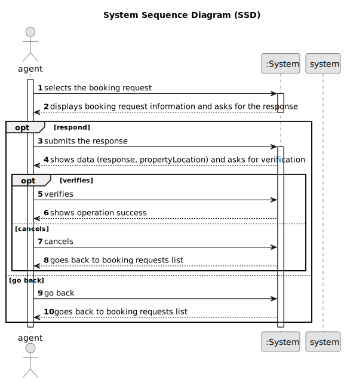

# US 016 - To respond to the user that scheduled the visit

## 1. Requirements Engineering

### 1.1. User Story Description

As an agent, when viewing a booking request, I want to respond to the user
that scheduled the visit.

### 1.2. Customer Specifications and Clarifications 

**From the specifications document:**

>	When the client decides to buy/rent the property, he sends a request for the purchase/lease of the property to the agent. After being appreciated by the agent, he accepts or rejects the order. If the request is accepted, the offer will not be shown again to clients using the application.

**From the client clarifications:**

> **Question:**	 Regarding the AC4, it is stated "The response should include the property identification and location.". Is the property identification the same as the location? If not, how should we handle it in the legacy file since there isn't a specific column for each?
>  
> **Answer:** The response should include only the property location.

> **Question:** Should the email with the reply be sent as a file, for example txt, or should it be sent as an email?
> 
> **Answer:** You should send/write the e-mail message to a file named email.txt. All e-mails to be send should be written to this file. We will not use real world e-mail services and this file is used to replace the real world e-mail services.

> **Question:** What should be the difference between Gmail and Dei email service?
> 
> **Answer:** These services must be configured using a configuration file to enable using different platforms.

> **Question:** Our team is having trouble understanding US016's AC2. Until now, the email has been sent in the form of a text file, however, with this AC, a configuration file that allows the use of different platforms has been introduced. How should the sending of emails be carried out then?
> 
> **Answer:** The configuration file defines the email service to be used. The URI of the email service should be defined in the configuration file. The URI can be the path of a file. Please discuss this question with your ESOFT teatchers.

> **Question:** When the agent requests the booking requests list to contact the client, that list should ONLY contain the requests related to that agent?
> 
> **Answer:** Yes. Listing is a feature described in US15.

> **Question:** When the agent is responding to the user that created the request, what should the answer be? Because accepting or declining the request is already done in US011.
> 
> **Answer:** In US11 the agent wants to accept or decline a purchase order for a property. In US16 the agent wants to answer visit requests.

> **Question:** In AC2, what is DEI's email service? Are you referring to Outlook?
> 
> **Answer:**  Different email services can send the message. These services must be configured using a configuration file to enable using different platforms (e.g.: gmail, DEI's email service, etc.). DEI email service is an email service like gmail or Outllook. These are only examples and you should prepare your system to support any email service.

> **Question:** To send an email, we must have a configuration file with the data: host, port, user, password, in which, the host will have a URL or a path to the text file, or should we have only the host field?
>
> **Answer:** In the configuration file you should only define the email service name (example: gmail) and the host address. The host address is a URI.

> **Question:**
>
> **Answer:**

### 1.3. Acceptance Criteria

* **AC1:** The response is sent by email.
* **AC2:** Different email services can send the message. These services must be configured using a configuration file to enable using different platforms (e.g.: gmail, DEI's email service, etc.)
* **AC3:** The response should include the name and phone number of the responsible Agent.
* **AC4:** The response should include the property identification and location.
* **AC5:** When an Agent responds to a booking request the list of booking requests should be updated to not show this request.

### 1.4. Found out Dependencies

* There is a dependency to "US015 - As an agent, I intend to list all booking requests for properties managed by
  me" because the agent must be able to see the listed booking requests, so he can respond to the user.

### 1.5 Input and Output Data

**Input Data:**

* Typed data:
	* response
	
* Selected data:
    * booking request     

**Output Data:**
* Booking request information
* Property locaion
* (In)Success of the operation

### 1.6. System Sequence Diagram (SSD)

### 1.7 Other Relevant Remarks

n/a