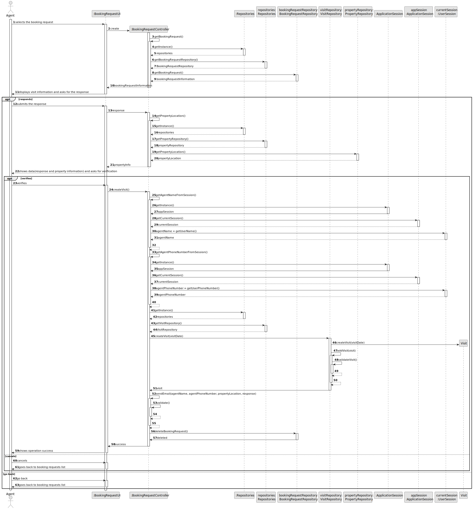
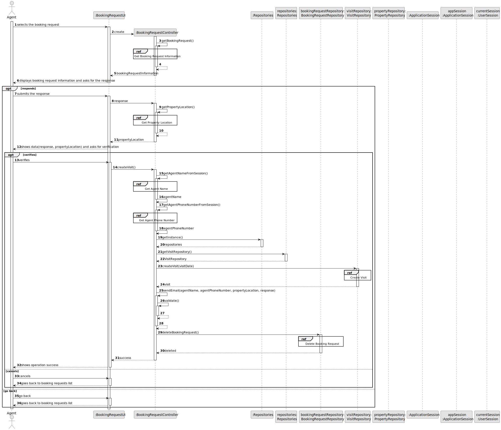
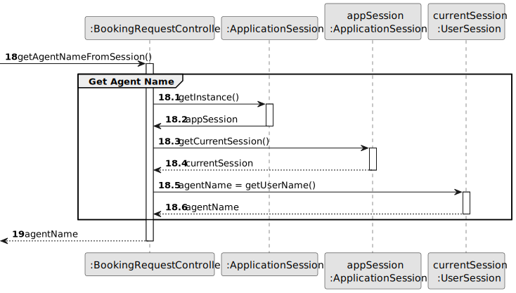
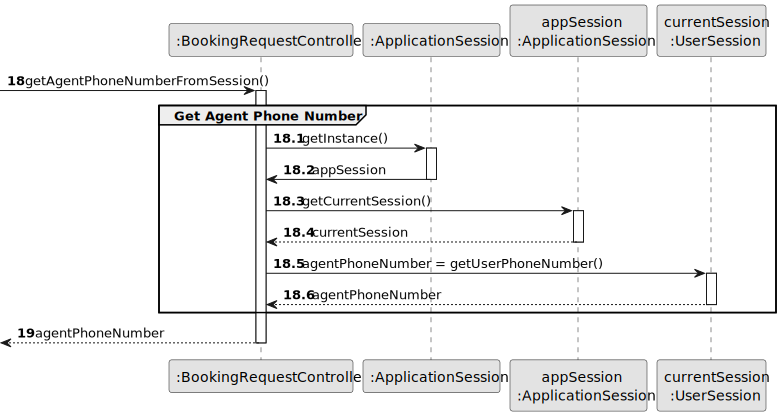
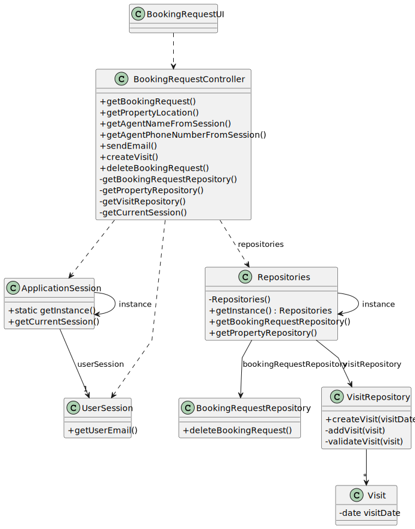

# US 010 - To place order to purchase property 

## 3. Design - User Story Realization 

### 3.1. Rationale

**SSD - Alternative 1 is adopted.**

| Interaction ID                                             | Question: Which class is responsible for... | Answer                   | Justification (with patterns)                                                                                 |
|:-----------------------------------------------------------|:--------------------------------------------|:-------------------------|:--------------------------------------------------------------------------------------------------------------|
| Step 1: selects the booking request                        | ... interacting with the actor?             | BookingRequestUI         | Pure Fabrication: there is no reason to assign this responsibility to any existing class in the Domain Model. |
| 		  		                                                     | ... coordinating the US?                    | BookingRequestController | Controller.                                                                                                   |
| Step 2: displays booking information and asks for response | ... getting the booking information?        | BookingRequestRepository | Pure Fabrication: there is no reason to assign this responsibility to any existing class in the Domain Model. |
| Step 3: submits the response                               | ... validating input data?                  | BookingRequestUI         | Pure Fabrication: there is no reason to assign this responsibility to any existing class in the Domain Model. |
|                                                            | ... getting property information?           | PropertyRepository       | Pure Fabrication: there is no reason to assign this responsibility to any existing class in the Domain Model. |
| Step 4: verifies the response                              | ... displaying all the data to the actor?   | BookingRequestUI         | Pure Fabrication: there is no reason to assign this responsibility to any existing class in the Domain Model. |
|                                                            | ... validating input data?                  | BookingRequestUI         | Pure Fabrication: there is no reason to assign this responsibility to any existing class in the Domain Model. |
|                                                            | ... sending the email?                      | BookingRequestController | Controller.                                                                                                   |
| Step 9: shows operation success                            | ... informing operation success?            | BookingRequestUI         | IE: is responsible for user interactions.                                                                     |

### Systematization ##

According to the taken rationale, the conceptual classes promoted to software classes are: 

 * Client
 * Order

Other software classes (i.e. Pure Fabrication) identified: 

 * BookingRequestUI
 * BookingRequestController
 * PropertyRepository
 * VisitRepository

## 3.2. Sequence Diagram (SD)

### Alternative 1 - Full Diagram

This diagram shows the full sequence of interactions between the classes involved in the realization of this user story.

### Alternative 2 - Split Diagram

This diagram shows the same sequence of interactions between the classes involved in the realization of this user story, but it is split in partial diagrams to better illustrate the interactions between the classes.

It uses interaction occurrence.

**Get Agent Name**

**Get Agent Phone Number**

## 3.3. Class Diagram (CD)

