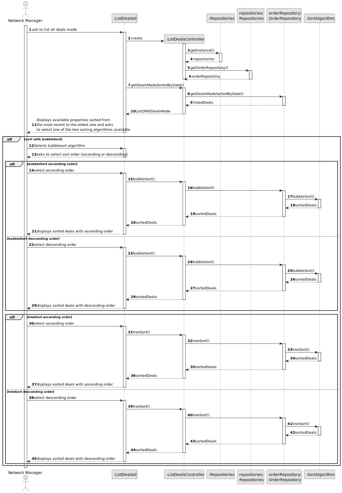
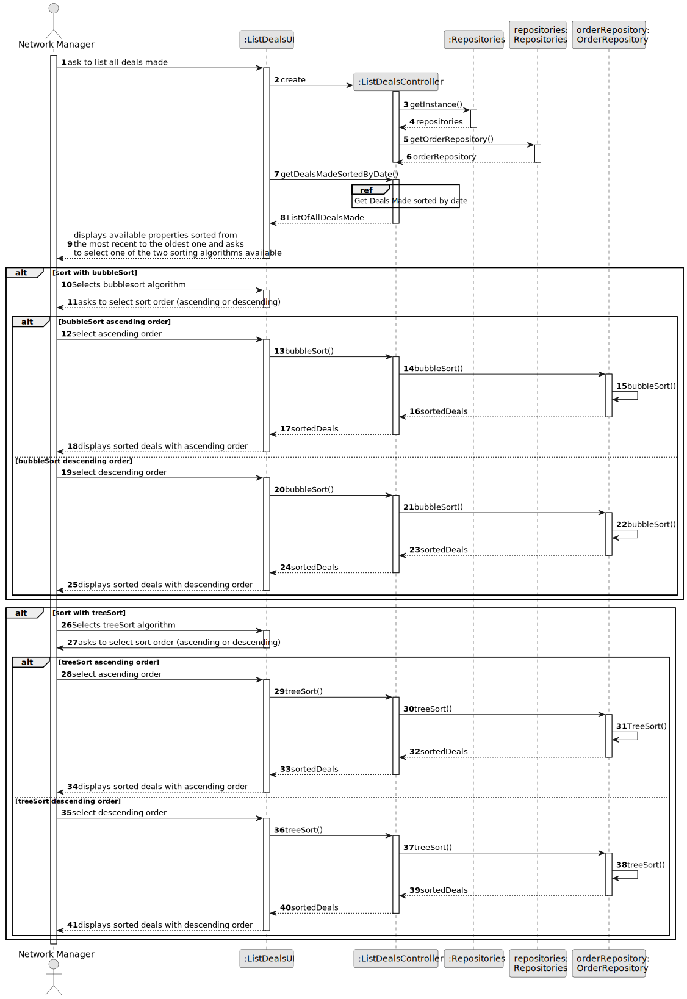
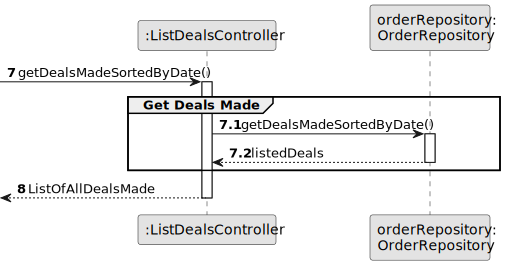
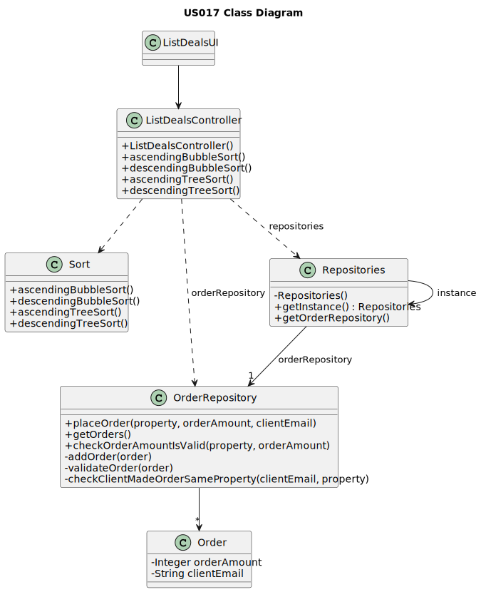

# US 017 - List all deals made 

## 3. Design - User Story Realization 

### 3.1. Rationale

**SSD - Alternative 1 is adopted.**

| Interaction ID                               | Question: Which class is responsible for... | Answer              | Justification (with patterns)                                                                                 |
|:---------------------------------------------|:--------------------------------------------|:--------------------|:--------------------------------------------------------------------------------------------------------------|
| Step 1: asks to list all deals               | ... interacting with the actor?             | ListDealsUI         | Pure Fabrication: there is no reason to assign this responsibility to any existing class in the Domain Model. |
|                                              | ... coordinating the US?                    | ListDealsController | Controller                                                                                                    |
|                                              | ... obtaining deals list?                   | OrderRepository     | IE and Pure Fabrication                                                                                       |
| Step 2: displays listing deals               | ... knowing the deals to show?              | ListDealsUI         | Pure Fabrication: there is no reason to assign this responsibility to any existing class in the Domain Model. |
|                                              | ... listing the deals newest to oldest?     | OrderRepository     | Repository                                                                                                    |
| Step 3: selects sort algorithm               | ... Choose sorting algorithm                | StoreNetworkManager | The StoreNetworkManager selects the sorting algorithm to be used.                                             |
|                                              | ... temporarily keeping the selected data?  | ListDealsUI         | Pure Fabrication: there is no reason to assign this responsibility to any existing class in the Domain Model. |
| Step 4: Select ascending or descending order | ... Select the type of order                | StoreNetworkManager | The StoreNetworkManager selects the sorting algorithm to be used.                                             |
 |                                              | ...sort the list with the algorithm         | OrderRepository     | Repository                                                                                                    |   
| Step 5: Show the sorted listing deals        | ... display the deals sorted                | ListDealsUI         | Pure Fabrication : there is no reason to assign this responsibility to any existing class in the Domain Model.                                                                                           |            
|                                              | ...                                         |                     |                                                                                                               |            
|                                              |                                             |                     |                                                                                                               |            
|                                              |                                             |                     |                                                                                                               |            

### Systematization ##

According to the taken rationale, the conceptual classes promoted to software classes are: 

 * Order

Other software classes (i.e. Pure Fabrication) identified: 

 * ListDealsUI
 * ListDealsController
 

## 3.2. Sequence Diagram (SD)

### Alternative 1 - Full Diagram

This diagram shows the full sequence of interactions between the classes involved in the realization of this user story.

 

### Alternative 2 - Split Diagram

This diagram shows the same sequence of interactions between the classes involved in the realization of this user story, but it is split in partial diagrams to better illustrate the interactions between the classes.

It uses interaction occurrence.

**Get Deals Made**

## 3.3. Class Diagram (CD)

