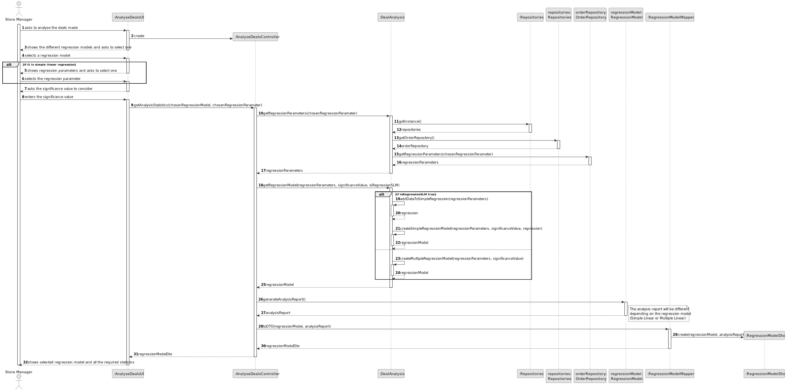
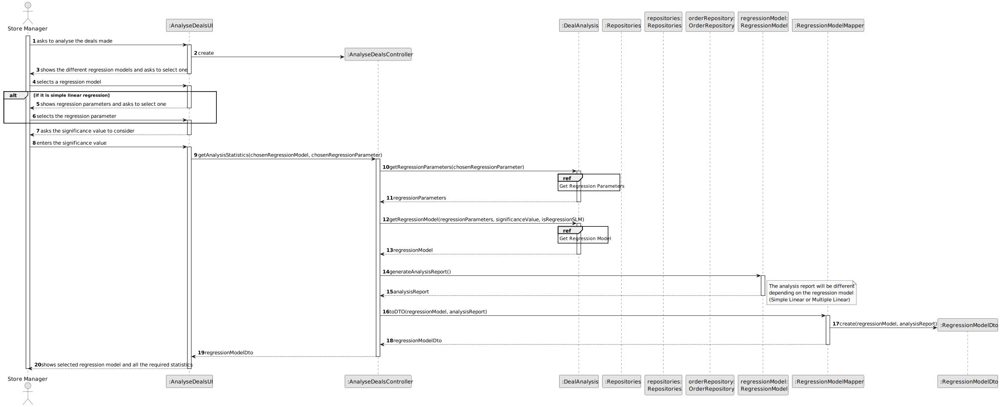
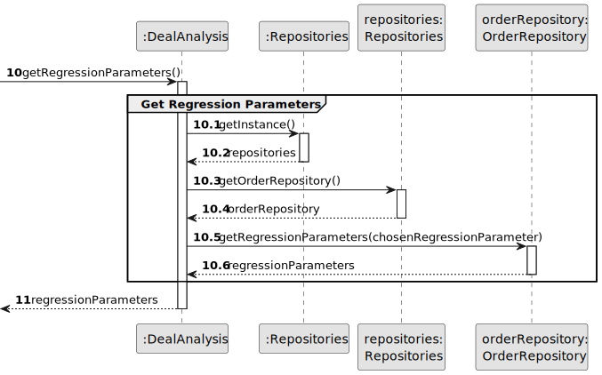
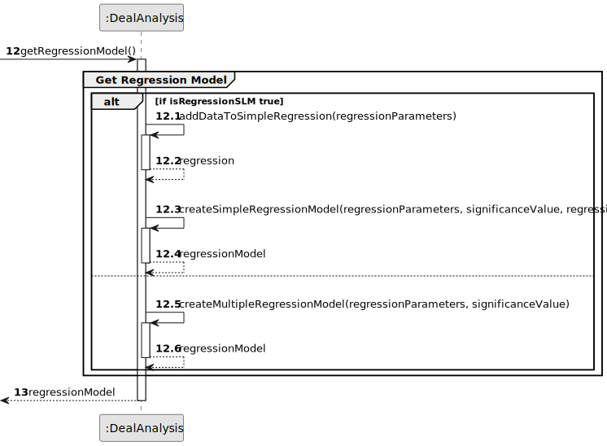
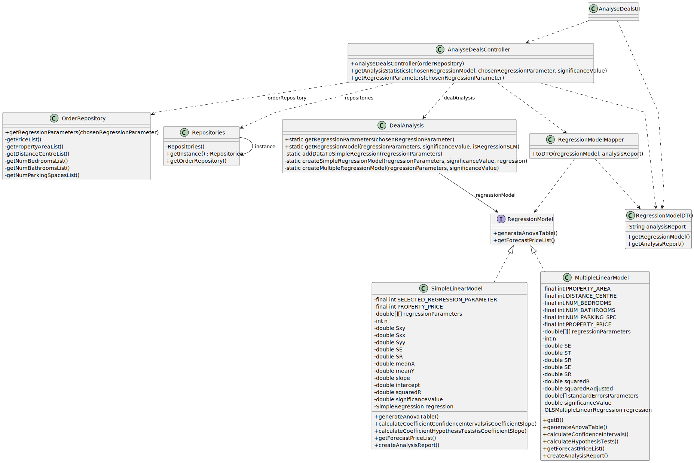

# US 018 - Analyse the deals made 

## 3. Design - User Story Realization 

### 3.1. Rationale

**SSD - Alternative 1 is adopted.**

| Interaction ID                                                          | Question: Which class is responsible for...                       | Answer                 | Justification (with patterns)                                                                                 |
|:------------------------------------------------------------------------|:------------------------------------------------------------------|:-----------------------|:--------------------------------------------------------------------------------------------------------------|
| Step 1: asks to analyse the deals made                                  | ... interacting with the actor?                                   | AnalyseDealsUI         | Pure Fabrication: there is no reason to assign this responsibility to any existing class in the Domain Model. |
|                                                                         | ... coordinating the US?                                          | AnalyseDealsController | Controller                                                                                                    |
|                                                                         | ... instantiating a Regression Model?                             | DealAnalysis           | Creator (Rule 4) : it has the data for initialising that object.                                              |     
| Step 2: shows the different regression models and asks to select one    | ... knowing the regression models to show?                        | AnalyseDealsUI         | Pure Fabrication: there is no reason to assign this responsibility to any existing class in the Domain Model. |
| Step 3: selects a regression model                                      | ... validating selected data (regression model)?                  | AnalyseDealsUI         | Pure Fabrication: there is no reason to assign this responsibility to any existing class in the Domain Model. |
|                                                                         | ... temporarily keeping the selected data (regression model)?     | AnalyseDealsUI         | Pure Fabrication: there is no reason to assign this responsibility to any existing class in the Domain Model. |
| Step 4: shows regression parameters and asks to select one              | ... knowing the regression parameters to show?                    | AnalyseDealsUI         | Pure Fabrication: there is no reason to assign this responsibility to any existing class in the Domain Model. |
| Step 5: selects the regression parameter                                | ... validating selected data (regression parameter)?              | AnalyseDealsUI         | Pure Fabrication: there is no reason to assign this responsibility to any existing class in the Domain Model. |
|                                                                         | ... temporarily keeping the selected data (regression parameter)? | AnalyseDealsUI         | Pure Fabrication: there is no reason to assign this responsibility to any existing class in the Domain Model. |
|                                                                         | ... generating all required statistics?                           | DealAnalysis           | IE: is responsible for the generating anything related to statistics.                                         |
| Step 6: asks the significance value to consider                         | ... displaying the UI for the actor to input data?                | AnalyseDealsUI         | Pure Fabrication: there is no reason to assign this responsibility to any existing class in the Domain Model. |
| Step 7: enters the significance value                                   | ... validating input data?                                        | AnalyseDealsUI         | Pure Fabrication: there is no reason to assign this responsibility to any existing class in the Domain Model. |
|                                                                         | ... saving the inputted data?                                     | RegressionModel        | IE: has it own data.                                                                                          |                                               
| Step 8: shows selected regression model and all the required statistics | ... showing the information results?                              | AnalyseDealsUI         | IE: is responsible for user interactions.                                                                     |

### Systematization ##

According to the taken rationale, the conceptual classes promoted to software classes are: 

 * DealAnalysis

Other software classes (i.e. Pure Fabrication) identified: 

 * AnalyseDealsUI
 * AnalyseDealsController
 * RegressionModel

## 3.2. Sequence Diagram (SD)

### Alternative 1 - Full Diagram

This diagram shows the full sequence of interactions between the classes involved in the realization of this user story.

### Alternative 2 - Split Diagram

This diagram shows the same sequence of interactions between the classes involved in the realization of this user story, but it is split in partial diagrams to better illustrate the interactions between the classes.

It uses interaction occurrence.

**Get Regression Parameters**

**Get Regression Model**

## 3.3. Class Diagram (CD)

