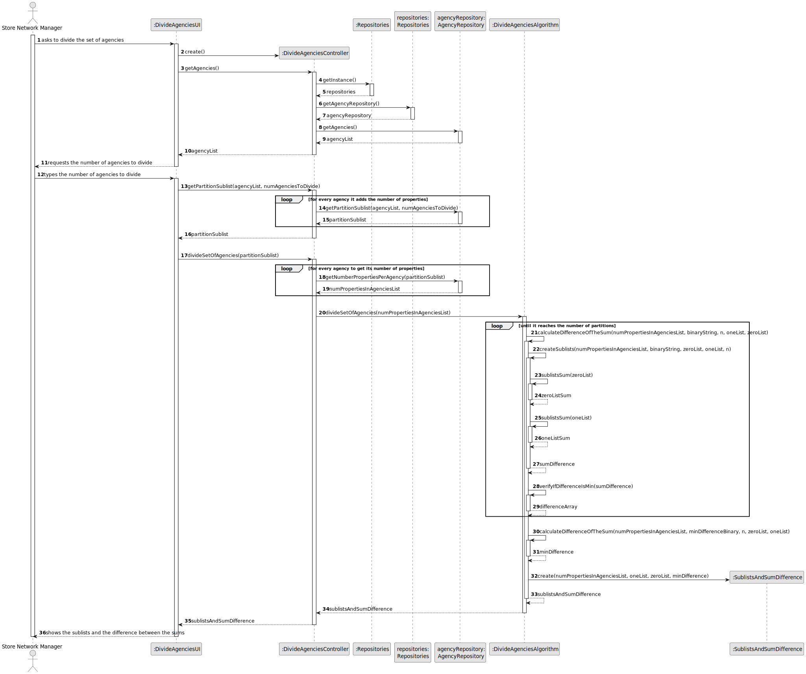
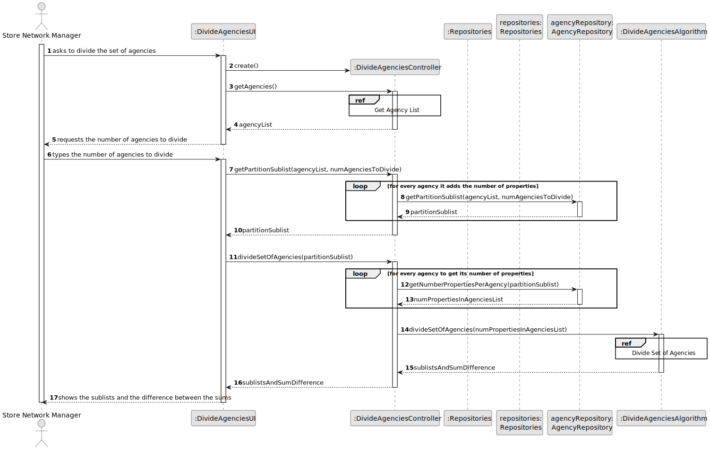
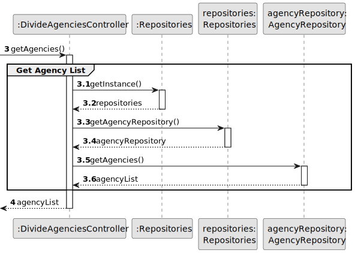
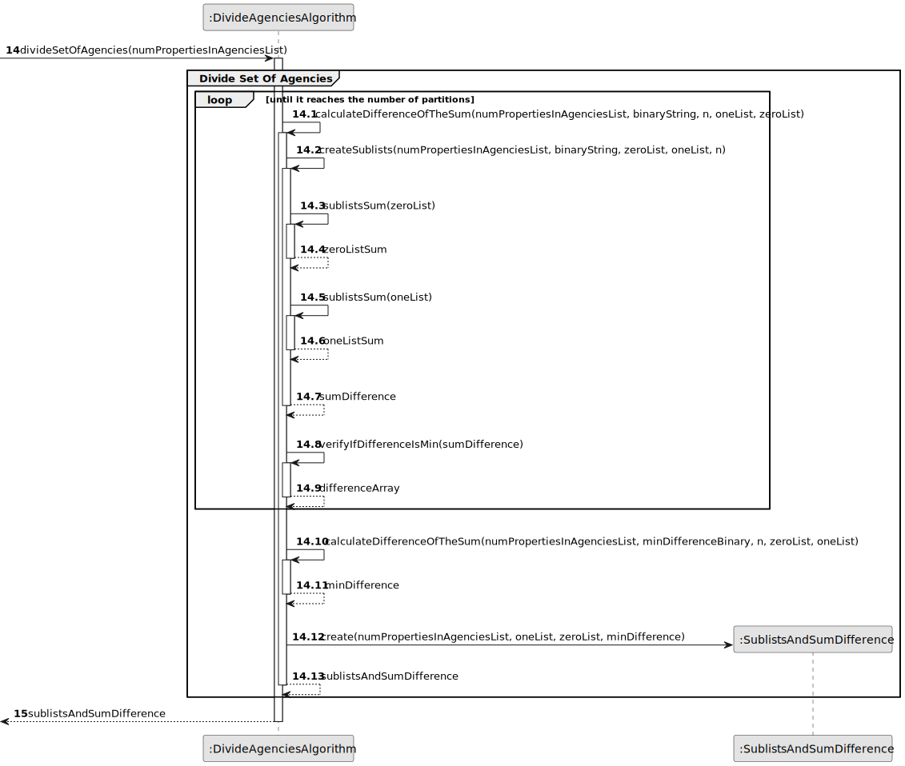
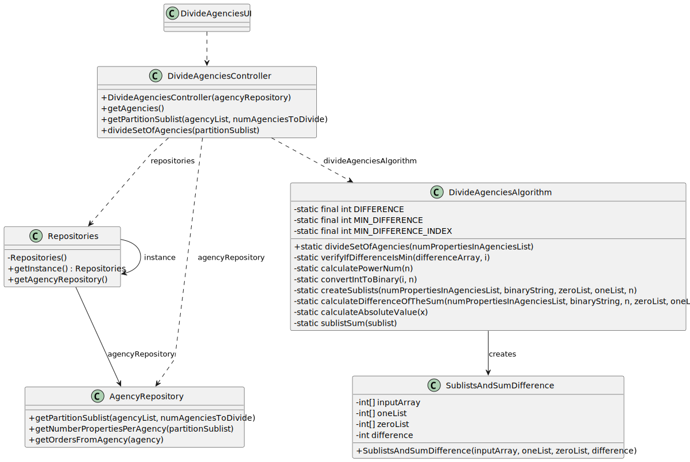

# US 019 - Divide set of stores into two subsets 

## 3. Design - User Story Realization 

### 3.1. Rationale

**SSD - Alternative 1 is adopted.**

| Interaction ID                                                 | Question: Which class is responsible for...             | Answer                      | Justification (with patterns)                                                                                 |
|:---------------------------------------------------------------|:--------------------------------------------------------|:----------------------------|:--------------------------------------------------------------------------------------------------------------|
| Step 1: asks to divide the set of agencies                     | ... interacting with the actor?                         | DivideAgenciesUI            | Pure Fabrication: there is no reason to assign this responsibility to any existing class in the Domain Model. |
|                                                                | ... coordinating the US?                                | DivideAgenciesController    | Controller                                                                                                    |
|                                                                | ... obtaining the agencies list?                        | AgencyRepository            | IE and Pure Fabrication.                                                                                      |
| Step 2: requests the number of agencies to divide              | ... displaying the UI for the actor to input data?      | DivideAgenciesUI            | Pure Fabrication: there is no reason to assign this responsibility to any existing class in the Domain Model. |
| Step 3: types the number of agencies to divide                 | ... validating input data?                              | DivideAgenciesUI            | Pure Fabrication: there is no reason to assign this responsibility to any existing class in the Domain Model. |
|                                                                | ... obtaining the number of properties in each agency?  | AgencyRepository            | IE: owns the list of orders which contains those properties.                                                  |
|                                                                | ... divide the set of agencies into two subsets?        | DivideAgenciesAlgorithm     | IE and Pure Fabrication.                                                                                      |
|                                                                | ... calculate the difference between the sums?          | DivideAgenciesAlgorithm     | IE and Pure Fabrication.                                                                                      |
|                                                                | ... instancing the SublistsAndDifference object?        | DivideAgenciesAlgorithm     | Creator (Rule 4) : it has the data for initialising that object.                                              |
| Step 4: shows the sublists and the difference between the sums | ... showing the sublists and the difference?            | DivideAgenciesUI            | IE: is responsible for user interactions.                                                                     |

### Systematization ##

According to the taken rationale, the conceptual classes promoted to software classes are: 

 * 

Other software classes (i.e. Pure Fabrication) identified: 

 * DivideAgenciesUI
 * DivideAgenciesController
 * AgencyRepository
 * DivideAgenciesAlgorithm
 * SublistsAndDifference

## 3.2. Sequence Diagram (SD)

### Alternative 1 - Full Diagram

This diagram shows the full sequence of interactions between the classes involved in the realization of this user story.

### Alternative 2 - Split Diagram

This diagram shows the same sequence of interactions between the classes involved in the realization of this user story, but it is split in partial diagrams to better illustrate the interactions between the classes.

It uses interaction occurrence.

**Get Agency List**

**Divide Set of Agencies**

## 3.3. Class Diagram (CD)

